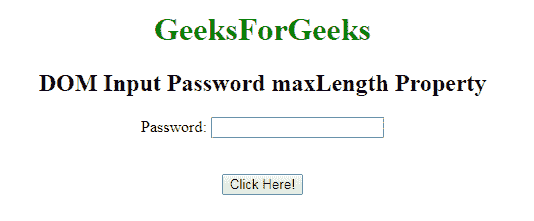
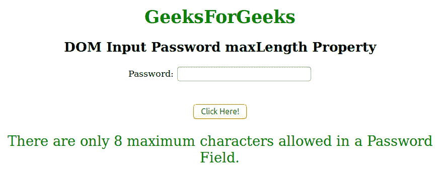
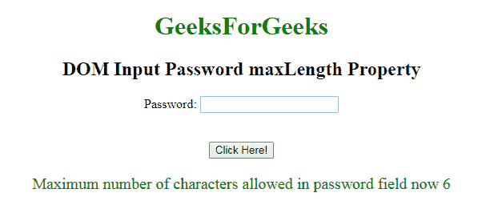

# HTML | DOM 输入密码最大长度属性

> 原文:[https://www . geesforgeks . org/html-DOM-input-password-maxlength-property/](https://www.geeksforgeeks.org/html-dom-input-password-maxlength-property/)

**DOM 输入密码最大长度属性**用于设置或返回密码字段的**最大长度属性的值。**指定元素中允许的最大字符数。

**语法:**

*   它用于返回 maxLength 属性。

    ```html
    passwordObject.maxLength
    ```

*   它用于设置 maxLength 属性。

    ```html
    passwordObject.maxLength = integer
    ```

**属性值:**

*   **数字:**指定**密码字段中允许的最大字符数。**

**返回值:**返回一个数值，代表密码字段中允许的最大字符数。

**示例:**这个示例说明了如何**返回**属性。

```html
<!DOCTYPE html> 
<html> 

<body style="text-align:center;"> 

    <h1 style="color:green;"> 
            GeeksForGeeks 
        </h1> 

    <h2>DOM Input Password maxLength Property</h2> 

   <form id="myGeeks">
     Password: <input type="password"
        id="myPsw"
          maxlength="8">
         </form>
    <br><br>
    <button onclick="myFunction()"> 
    Click Here! 
</button> 

    <p id="demo" style="color:green;font-size:25px;"></p> 

    <script> 
        function myFunction() { 
            var x = 
            document.getElementById( 
            "myPsw").maxLength;

            document.getElementById( 
            "demo").innerHTML = 
          There are only " + x + " maximum characters" +
             "allowed in a Password Field."; 
        } 
    </script> 

</body> 

</html>                    
```

**输入:**
**后点击按钮:**


**输出:**
**点击按钮后:**

**示例-2:** 本示例说明如何**设置**属性。

```html
<!DOCTYPE html> 
<html> 

<body style="text-align:center;"> 

    <h1 style="color:green;"> 
            GeeksForGeeks 
        </h1> 

    <h2>DOM Input Password maxLength Property</h2> 

   <form id="myGeeks">
     Password: <input type="password"
        id="myPsw"
          maxlength="8">
         </form>
    <br><br>
    <button onclick="myFunction()"> 
    Click Here! 
</button> 

    <p id="demo" style="color:green;font-size:20px;"></p> 

    <script> 
        function myFunction() { 
            var x = 
            document.getElementById( 
            "myPsw").maxLength = 6;

            document.getElementById( 
            "demo").innerHTML = 
    "Maximum number of characters allowed " +
     "in password field now " + x; 
        } 
    </script> 

</body> 

</html>                    
```

**输出:**
**点击按钮前:**

**点击按钮后:**


**支持的浏览器:**T2 DOM 输入密码最大长度属性支持的浏览器如下:

*   谷歌 Chrome
*   微软公司出品的 web 浏览器
*   火狐浏览器
*   歌剧
*   旅行队