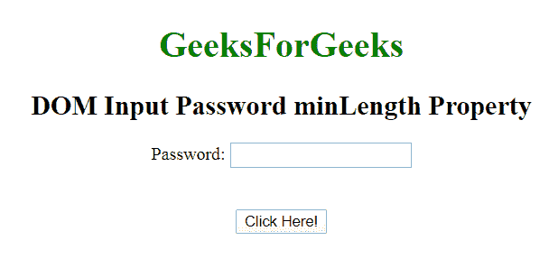
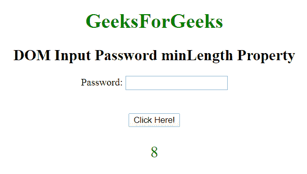
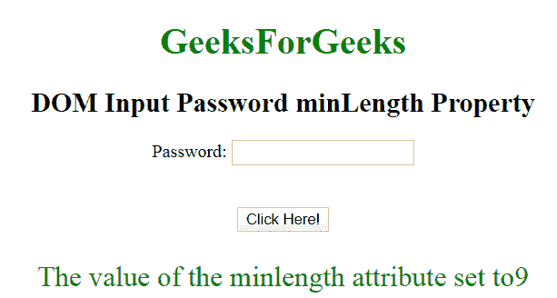

# HTML | DOM 输入密码最小长度属性

> 原文:[https://www . geesforgeks . org/html-DOM-input-password-min length-property/](https://www.geeksforgeeks.org/html-dom-input-password-minlength-property/)

**HTML DOM 输入密码最小长度属性**用于设置或返回密码字段的最小长度属性的值。它指定元素中允许的最小字符数。

**语法:**

*   它用于返回 minLength 属性。

    ```html
    passwordObject.minLength
    ```

*   它用于设置 minLength 属性。

    ```html
    passwordObject.minLength = integer
    ```

**属性值:**

*   **数字:**指定**密码字段中允许的最小字符数。**

**返回值:**返回一个数值，代表密码字段中允许的最小字符数。

**例 1:** 这个例子说明了如何**返回**属性。

```html
<!DOCTYPE html>
<html>

<body style="text-align:center;">

    <h1 style="color:green;">
        GeeksForGeeks
    </h1>

    <h2>DOM Input Password minLength Property</h2>

    <form id="myGeeks">
        Password: <input type="password"
            id="myPsw" minlength="8">
    </form>

    <br><br>

    <button onclick="myFunction()">
        Click Here!
    </button>

    <p id="demo" style=
        "color:green;font-size:25px;">
    </p>

    <script>
        function myFunction() {
            var x = document.getElementById(
                        "myPsw").minLength;

            document.getElementById(
                    "demo").innerHTML = x;
        } 
    </script>
</body>

</html>
```

**输出:**

*   **点击按钮前:**
    
*   **点击按钮后:**
    

**示例 2:** 本示例说明如何设置属性。

```html
<!DOCTYPE html>
<html>

<body style="text-align:center;">

    <h1 style="color:green;">
        GeeksForGeeks
    </h1>

    <h2>DOM Input Password minLength Property</h2>

    <form id="myGeeks">
        Password: <input type="password"
            id="myPsw" minlength="8">
    </form>

    <br><br>

    <button onclick="myFunction()">
        Click Here!
    </button>

    <p id="demo" style=
        "color:green;font-size:25px;">
    </p>

    <script>
        function myFunction() {
            var x = document.getElementById(
                    "myPsw").minLength = "9";

            document.getElementById("demo").innerHTML
                    = "The value of the minlength "
                    + "attribute set to" + x;
        } 
    </script>
</body>

</html>                   
```

**输出:**

*   **点击按钮前:**
    
*   **点击按钮后:**
    