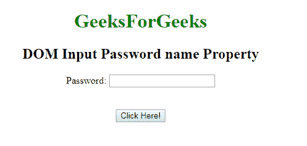
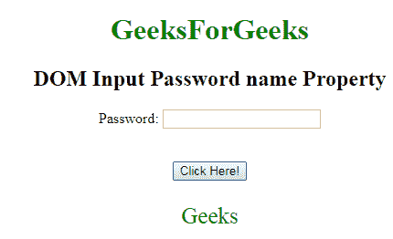
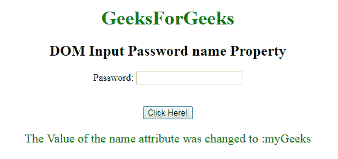

# HTML | DOM 输入密码名称属性

> 原文:[https://www . geesforgeks . org/html-DOM-input-password-name-property/](https://www.geeksforgeeks.org/html-dom-input-password-name-property/)

**DOM 输入密码名称属性**用于设置或返回密码字段的**名称属性的值。**每个输入字段都需要名称属性。如果没有在输入字段中指定 name 属性，则根本不会发送该字段的数据。

**语法:**

*   它用于返回 name 属性。

```html
passwordObject.name
```

*   它用于设置 name 属性。

```html
passwordObject.name = name
```

**属性值:**

*   **名称:**定义**密码字段的名称。**

**返回值:**返回一个代表**密码字段名称的字符串值。**
**示例-1:** 本示例说明如何**返回**属性。

## 超文本标记语言

```html
    <!DOCTYPE html>
<html>

<body style="text-align:center;">

    <h1 style="color:green;">
            GeeksForGeeks
        </h1>

    <h2>DOM Input Password name Property</h2>

<form id="myGeeks">
    Password: <input type="password"
        id="myPsw"
        name="Geeks">
        </form>
    <br><br>
    <button onclick="myFunction()">
    Click Here!
</button>

    <p id="demo" style="color:green;font-size:25px;"></p>

    <script>
        function myFunction() {
            var x =
            document.getElementById(
            "myPsw").name;

            document.getElementById(
            "demo").innerHTML = x;

        }
    </script>

</body>

</html>                   
```

**输出:**
**点击按钮前:**



**点击按钮后:**



**示例-2:** 本示例说明如何**设置**属性。

## 超文本标记语言

```html
<!DOCTYPE html>
<html>

<body style="text-align:center;">

    <h1 style="color:green;">
            GeeksForGeeks
        </h1>

    <h2>DOM Input Password name Property</h2>

<form id="myGeeks">
    Password: <input type="password"
        id="myPsw"
        name="Geeks">
        </form>
    <br><br>
    <button onclick="myFunction()">
    Click Here!
</button>

    <p id="demo" style="color:green;font-size:20px;"></p>

    <script>
        function myFunction() {
            var x =
            document.getElementById(
            "myPsw").name = "myGeeks";

            document.getElementById(
            "demo").innerHTML =
        "The Value of the name attribute" +
        " was changed to :" + x;

        }
    </script>

</body>

</html>                   
```

**输出:**
**点击按钮前:**


**点击按钮后:**



**支持的浏览器:**T2 DOM 输入密码名称属性支持的浏览器如下:

*   谷歌 Chrome
*   微软公司出品的 web 浏览器
*   火狐浏览器
*   歌剧
*   旅行队