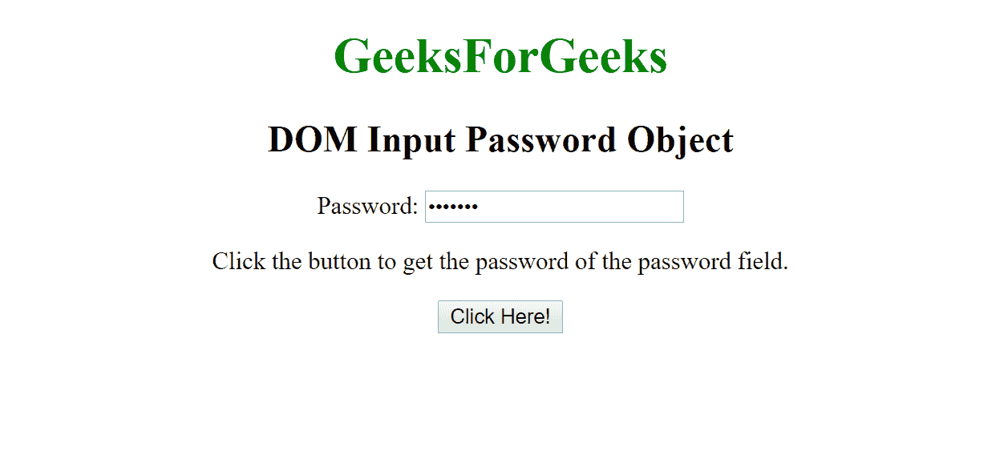
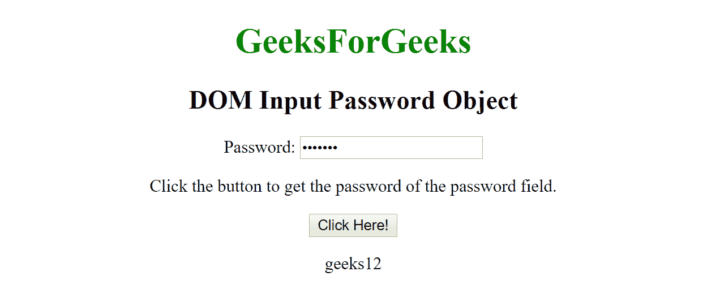
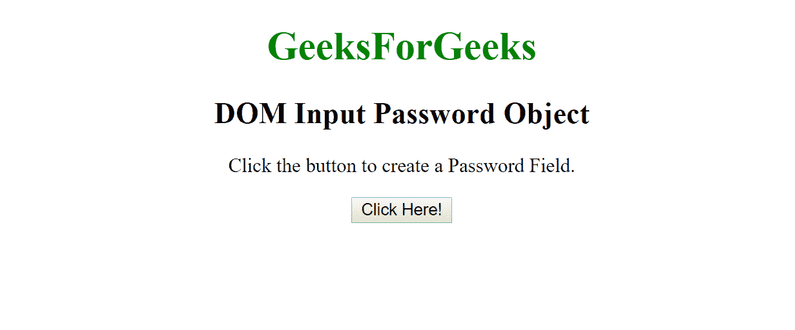
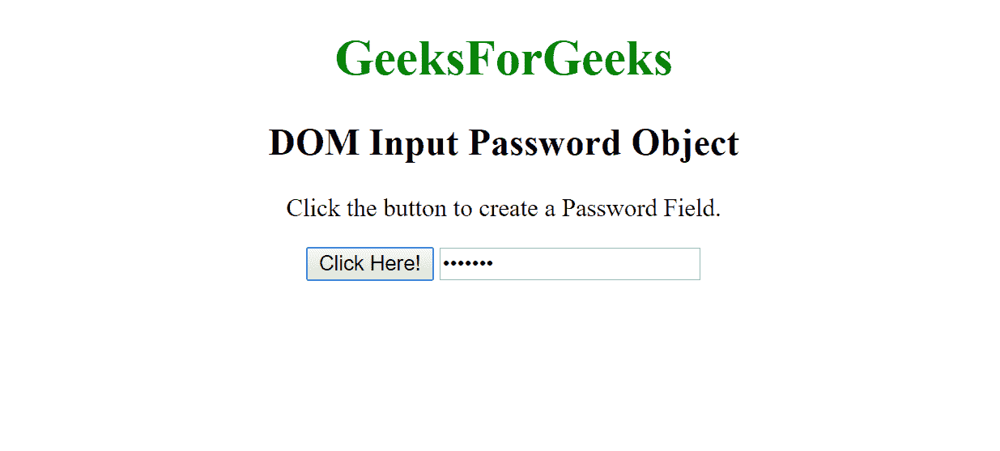

# HTML | DOM 输入密码对象

> 原文:[https://www . geesforgeks . org/html-DOM-input-password-object/](https://www.geeksforgeeks.org/html-dom-input-password-object/)

HTML DOM 中的**输入密码对象**用来表示一个带有**类型=“密码”**的 HTML 输入元素。
使用 **getElementById()方法**可以访问 **type="password"** 的输入元素。

**语法:**

*   **用于访问输入类型=“密码”**

    ```html
    document.getElementById("id");
    ```

*   **用于创建 type="password "元素。**

    ```html
    document.createElement("input");
    ```

**对象属性:**

| 财产 | 描述 |
| 类型 | 此属性用于返回密码字段是哪种类型的表单元素。 |
| 价值 | 此属性用于设置或返回密码字段的 value 属性值。 |
| 自动完成 | 此属性用于设置或返回密码字段的自动完成属性的值。 |
| 自（动）调焦装置 | 此属性用于设置或返回页面加载时密码字段是否应自动获得焦点。 |
| 缺省值 | 此属性用于设置或返回密码字段的默认值。 |
| 有缺陷的 | 此属性用于设置或返回密码字段是否被禁用。 |
| 形式 | 此属性用于返回对包含密码字段的表单的引用。 |
| 最大长 | 此属性用于设置或返回密码字段的 maxlength 属性值。 |
| 名字 | 此属性用于设置或返回密码字段的名称属性值。 |
| 占位符 | 此属性用于设置或返回密码字段的占位符属性值。 |
| 只读的 | 此属性用于设置或返回密码字段是否为只读。 |
| 需要 | 此属性用于设置或返回提交表单前是否必须填写密码字段。 |
| 大小 | 此属性用于设置或返回密码字段的值属性的值。 |

**输入数字对象方法:**

*   **选择():**用于选择密码字段的内容。

**示例-1:**

```html
<!DOCTYPE html>
<html>

<body style="text-align:center;">

    <h1 style="color:green;">  
            GeeksForGeeks  
        </h1>

    <h2>DOM Input Password Object</h2> Password:
    <input type="password"
           id="myPsw" 
           value="geeks12">

    <p>Click the button to get the password 
      of the password field.</p>

    <button onclick="myFunction()">
      Click Here!
   </button>

    <p id="demo"></p>

    <script>
        function myFunction() {
            var x = 
            document.getElementById(
              "myPsw").value;

            document.getElementById(
              "demo").innerHTML = x;
        }
    </script>

</body>

</html>
```

**输出:**

**之前点击按钮:**


**点击按钮后:**


**示例-2:**

```html
<!DOCTYPE html>
<html>

<body style="text-align:center;">

    <h1 style="color:green;">  
            GeeksForGeeks  
        </h1>

    <h2>DOM Input Password Object</h2>

    <p>Click the button to create a
      Password Field.</p>

    <button onclick="myFunction()">
      Click Here!
    </button>

    <script>
        function myFunction() {

            // Creating input element.
            var x = document.createElement("INPUT");

            // Set type password.
            x.setAttribute("type", "password");
            x.setAttribute("value", "geeks12");
            document.body.appendChild(x);
        }
    </script>

</body>

</html>
```

**输出:**

**之前点击按钮:**


**点击按钮后:**


**支持的浏览器:**

*   谷歌 Chrome
*   Mozilla Firefox
*   边缘
*   旅行队
*   歌剧