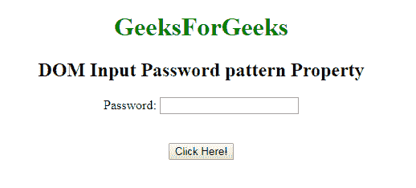
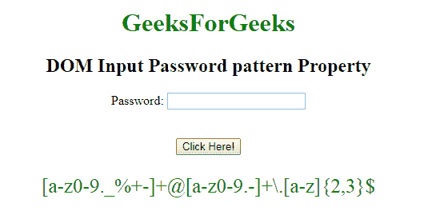

# HTML | DOM 输入密码模式属性

> 原文:[https://www . geesforgeks . org/html-DOM-input-password-pattern-property/](https://www.geeksforgeeks.org/html-dom-input-password-pattern-property/)

HTML DOM 中的**输入密码模式属性**用于设置或返回密码字段的模式属性值。此属性用于指定检查输入元素值所依据的正则表达式。使用全局标题属性来描述帮助用户的模式。

**语法:**

*   它返回输入密码模式属性。

    ```html
    passwordObject.pattern
    ```

*   它用于设置输入密码模式属性。

    ```html
    passwordObject.pattern = regexp
    ```

**属性值:**它接受单个值**正则表达式**，用于指定检查密码字段值的正则表达式。

**返回值:**它返回一个字符串值，该值代表检查密码字段值所依据的正则表达式。

**示例:**本示例描述了输入密码模式属性的使用。

```html
<!DOCTYPE html> 
<html> 

<head>
    <title>
        HTML DOM Input Password pattern Property
    </title>
</head>

<body style="text-align:center;"> 

    <h1 style="color:green;"> 
            GeeksForGeeks 
        </h1> 

    <h2>DOM Input Password pattern Property</h2> 

    <form id="myGeeks">
        Password: <input type="password" id="myPsw" name="Geeks"
            pattern="[a-z0-9._%+-]+@[a-z0-9.-]+\.[a-z]{2, 3}{content}quot; >
    </form>

    <br><br>

    <button onclick="myFunction()"> 
        Click Here! 
    </button> 

    <p id="demo" style="color:green;font-size:25px;"></p> 

    <!-- Script to use Input Password pattern Property -->
    <script> 
        function myFunction() { 
            var x = 
            document.getElementById( 
            "myPsw").pattern;

            document.getElementById( 
            "demo").innerHTML = x;
        } 
    </script> 
</body> 

</html>                            
```

**输出:**
**点击按钮前:**

**点击按钮后:**


**支持的浏览器:**T2 DOM 输入密码模式属性支持的浏览器如下:

*   谷歌 Chrome
*   Internet Explorer 10.0
*   火狐浏览器
*   歌剧
*   旅行队