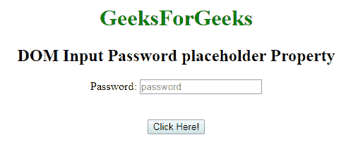
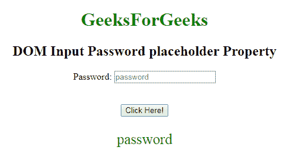
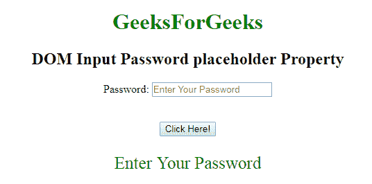

# HTML | DOM 输入密码占位符属性

> 原文:[https://www . geesforgeks . org/html-DOM-input-password-placeholder-property/](https://www.geeksforgeeks.org/html-dom-input-password-placeholder-property/)

**DOM 输入密码占位符属性**用于设置或返回密码字段的**占位符属性的值。**占位符属性指定一个简短的提示，描述输入字段的预期值。在用户输入值之前，短提示会显示在字段中。

**语法:**

*   它用于返回占位符属性。

    ```html
    passwordObject.placeholder
    ```

*   它用于设置占位符属性。

    ```html
    passwordObject.placeholder = text
    ```

**属性值:**

*   **文本:**它定义了一个简短的提示，描述了密码字段的预期值。

**返回值:**它返回一个字符串值，该值表示描述密码字段预期值的简短提示。

**示例-1:** 本示例说明了如何**返回**属性。

```html
<!DOCTYPE html> 
<html> 

<body style="text-align:center;"> 

    <h1 style="color:green;"> 
            GeeksForGeeks 
        </h1> 

    <h2>DOM Input Password placeholder Property</h2> 

<form id="myGeeks">
    Password: <input type="password"
        id="myPsw"
        name="Geeks"
        placeholder="password">
        </form>
    <br><br>
    <button onclick="myFunction()"> 
    Click Here! 
</button> 

    <p id="demo" style="color:green;font-size:25px;"></p> 

    <script> 
        function myFunction() { 
            var x = 
            document.getElementById( 
            "myPsw").placeholder;

            document.getElementById( 
            "demo").innerHTML = x;
        } 
    </script> 

</body> 

</html>                    
```

**输出:**

**点击按钮前:**

**点击按钮后:**


**例-2:** 本例说明如何**设置**属性。

```html
<!DOCTYPE html> 
<html> 

<body style="text-align:center;"> 

    <h1 style="color:green;"> 
            GeeksForGeeks 
        </h1> 

    <h2>DOM Input Password placeholder Property</h2> 

<form id="myGeeks">
    Password: <input type="password"
        id="myPsw"
        name="Geeks"
        placeholder="password">
        </form>
    <br><br>
    <button onclick="myFunction()"> 
    Click Here! 
</button> 

    <p id="demo" style="color:green;font-size:25px;"></p> 

    <script> 
        function myFunction() { 
            var x = 
            document.getElementById( 
            "myPsw").placeholder ="Enter Your Password";

            document.getElementById( 
            "demo").innerHTML = x;
        } 
    </script> 

</body> 

</html>                    
```

**输出:**
**点击按钮前:**

**点击按钮后:**


**支持的浏览器:**T2 DOM 输入密码占位符属性支持的浏览器如下:

*   谷歌 Chrome
*   微软公司出品的 web 浏览器
*   火狐浏览器
*   歌剧
*   旅行队