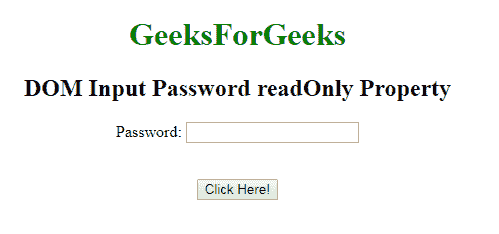

# HTML | DOM 输入密码只读属性

> 原文:[https://www . geesforgeks . org/html-DOM-input-password-readonly-property/](https://www.geeksforgeeks.org/html-dom-input-password-readonly-property/)

**DOM 输入密码只读属性**用于设置或返回密码字段是否应为只读。这意味着用户不能修改或更改特定元素中已经存在的内容(但是，用户可以定位到它，突出显示它，并从中复制文本)，而 JavaScript 可以用于更改只读值并使输入字段可编辑。

**语法:**

*   它用于返回 readOnly 属性。

    ```html
    passwordObject.readOnly
    ```

*   它用于设置只读属性。

    ```html
    passwordObject.readOnly = true|false
    ```

**属性值:**

*   **true:** 定义密码字段为只读。
*   **false:** 为默认值。它定义密码字段不是只读的。

**返回值:**返回一个布尔值，表示密码字段是否为只读。

**示例-1:** 这个示例说明了如何返回属性。

```html
<!DOCTYPE html> 
<html> 

<body style="text-align:center;"> 

    <h1 style="color:green;"> 
            GeeksForGeeks 
        </h1> 

    <h2>DOM Input Password readOnly Property</h2> 

   <form id="myGeeks">
     Password: <input type="password"
        id="myPsw"
          readonly>
         </form>
    <br><br>
    <button onclick="myFunction()"> 
    Click Here! 
</button> 

    <p id="demo" style="color:green;font-size:20px;"></p> 

    <script> 
        function myFunction() { 
            var x = 
            document.getElementById( 
            "myPsw").readOnly

            document.getElementById( 
            "demo").innerHTML = x; 
        } 
    </script> 

</body> 

</html>                    
```

**输出:**

**点击按钮前:**

**点击按钮后:**

**示例-2 :** 本示例说明如何**设置**属性。

```html
<!DOCTYPE html> 
<html> 

<body style="text-align:center;"> 

    <h1 style="color:green;"> 
            GeeksForGeeks 
        </h1> 

    <h2>DOM Input Password readOnly Property</h2> 

   <form id="myGeeks">
     Password: <input type="password"
        id="myPsw"
          readonly>
         </form>
    <br><br>
    <button onclick="myFunction()"> 
    Click Here! 
</button> 

    <p id="demo" style="color:green;font-size:20px;"></p> 

    <script> 
        function myFunction() { 
            var x = 
            document.getElementById( 
            "myPsw").readOnly = false;

            document.getElementById( 
            "demo").innerHTML = x; 
        } 
    </script> 

</body> 

</html>                    
```

**输出**

**点击按钮前:**

**点击按钮后:**


**支持的浏览器:**T2 DOM 输入密码只读属性支持的浏览器如下:

*   谷歌 Chrome
*   微软公司出品的 web 浏览器
*   火狐浏览器
*   歌剧
*   旅行队