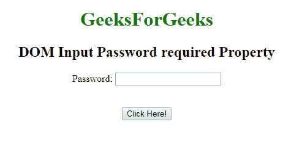
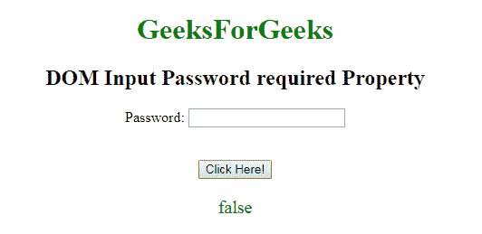
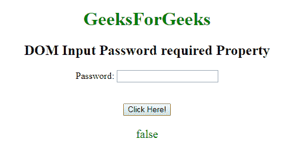

# HTML | DOM 需要输入密码属性

> 原文:[https://www . geesforgeks . org/html-DOM-input-password-required-property/](https://www.geeksforgeeks.org/html-dom-input-password-required-property/)

**DOM 需要输入密码属性**用于设置或返回提交表单时是否需要填写输入密码字段。此属性用于反映 HTML 必需的属性。

**语法:**

*   它用于返回所需的属性。

    ```html
    passwordObject.required
    ```

*   它用于设置所需的属性。

    ```html
    passwordObject.required = true|false
    ```

**属性值:**

*   **true:** 指定提交表单前必须填写密码字段。
*   **false:** 为默认值。它指定在提交表单之前不得填写“密码”字段。

**返回值:**返回一个布尔值，表示在提交表单之前必须填写或不填写密码字段。

**例-1:** 本例说明了如何**归还**房产。

```html
<!DOCTYPE html> 
<html> 

<body style="text-align:center;"> 

    <h1 style="color:green;"> 
            GeeksForGeeks 
        </h1> 

    <h2>DOM Input Password required Property</h2> 

   <form id="myGeeks">
     Password: <input type="password"
        id="myPsw"
          required>
         </form>
    <br><br>
    <button onclick="myFunction()"> 
    Click Here! 
</button> 

    <p id="demo" style="color:green;font-size:20px;"></p> 

    <script> 
        function myFunction() { 
            var x = 
            document.getElementById( 
            "myPsw").required;

            document.getElementById( 
            "demo").innerHTML = x; 
        } 
    </script> 

</body> 

</html>                    
```

**输出:**

**点击按钮前:**


**点击按钮后:**


**示例-2:** 本示例说明如何**设置**属性。

```html
<!DOCTYPE html> 
<html> 

<body style="text-align:center;"> 

    <h1 style="color:green;"> 
            GeeksForGeeks 
        </h1> 

    <h2>DOM Input Password required Property</h2> 

   <form id="myGeeks">
     Password: <input type="password"
        id="myPsw"
          required>
         </form>
    <br><br>
    <button onclick="myFunction()"> 
    Click Here! 
</button> 

    <p id="demo" style="color:green;font-size:20px;"></p> 

    <script> 
        function myFunction() { 
            var x = 
            document.getElementById( 
            "myPsw").required = false;

            document.getElementById( 
            "demo").innerHTML = x; 
        } 
    </script> 

</body> 

</html>                    
```

**输出:**
强>点击按钮前:

**点击按钮后:**


**支持的浏览器:****DOM 输入密码所需属性**支持的浏览器如下:

*   谷歌 Chrome
*   微软公司出品的 web 浏览器
*   火狐浏览器
*   歌剧
*   旅行队