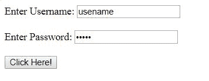

# HTML | DOM 输入密码选择()方法

> 原文:[https://www . geesforgeks . org/html-DOM-输入-密码-选择-方法/](https://www.geeksforgeeks.org/html-dom-input-password-select-method/)

在*选择密码字段*的内容时，使用了 HTML DOM 中的**输入密码选择()方法**。

**语法:**

```html
passwordObject.select()
```

**参数:**不接受任何参数。

**返回值:**不返回值。

**示例:**本示例使用**输入密码选择()**方法选择密码。

```html
<!DOCTYPE html>
<html>

<head>
    <title>
        HTML DOM Input Password select() Method
    </title>
</head>

<body>

    Enter Username:
    <input type="text" 
           value="usename">
    <br>
    <br> Enter Password:
    <input type="password" 
           value="geeks"
           id="passwd">
    <br>
    <br>
    <button onclick="myGeeks()">
      Click Here!
  </button>

    <script>
        function myGeeks() {
            document.getElementById(
              "passwd").select();
        }
    </script>
</body>

</html>
```

**输出:**
**点击按钮前:**

**点击按钮后:**


**支持的浏览器:**以下是**输入密码选择()**方法支持的浏览器:

*   谷歌 Chrome
*   微软公司出品的 web 浏览器
*   火狐浏览器
*   旅行队
*   歌剧