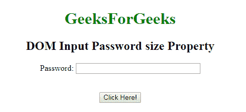
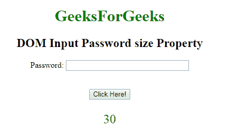
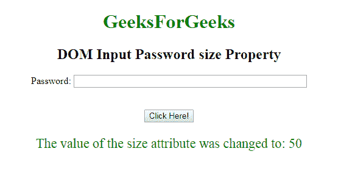

# HTML | DOM 输入密码大小属性

> 原文:[https://www . geesforgeks . org/html-DOM-input-password-size-property/](https://www.geeksforgeeks.org/html-dom-input-password-size-property/)

**DOM 输入密码大小属性**用于设置或返回输入密码字段的大小属性值。大小属性用于定义电子邮件字段的宽度。它的默认值是 20。

**语法:**

*   它用于返回 size 属性。

    ```html
    passwordObject.size
    ```

*   它用于设置 size 属性。

    ```html
    passwordObject.size = number
    ```

**属性值:**包含单个值**数字**，用于根据字符数指定密码字段的宽度。

**返回值:**返回代表密码字段宽度的数值，以字符数表示。

**示例 1:** 本示例说明如何返回输入密码大小属性。

```html
<!DOCTYPE html> 
<html> 

<body style="text-align:center;"> 

    <h1 style="color:green;"> 
            GeeksForGeeks 
        </h1> 

    <h2>DOM Input Password size Property</h2> 

   <form id="myGeeks">
     Password: <input type="password"
        id="myPsw"
          size="30">
         </form>
    <br><br>
    <button onclick="myFunction()"> 
    Click Here! 
</button> 

    <p id="demo" style="color:green;font-size:25px;"></p> 

    <script> 
        function myFunction() { 
            var x = 
            document.getElementById( 
            "myPsw").size;

            document.getElementById( 
            "demo").innerHTML = x; 
        } 
    </script> 

</body> 

</html>                    
```

**输出:**
**点击按钮前:**


**点击按钮后:**


**例-2 :** 本例说明如何**设置**属性。

```html
<!DOCTYPE html> 
<html> 

<body style="text-align:center;"> 

    <h1 style="color:green;"> 
            GeeksForGeeks 
        </h1> 

    <h2>DOM Input Password size Property</h2> 

   <form id="myGeeks">
     Password: <input type="password"
        id="myPsw"
          size="30">
         </form>
    <br><br>
    <button onclick="myFunction()"> 
    Click Here! 
</button> 

    <p id="demo" style="color:green;font-size:22px;"></p> 

    <script> 
        function myFunction() { 
            var x = 
            document.getElementById( 
            "myPsw").size = "50";

            document.getElementById( 
            "demo").innerHTML = 
      "The value of the size attribute was changed to: " + x; 
        } 
    </script> 

</body> 

</html>                    
```

**输出:**
**点击按钮前:**

**点击按钮后:**


**支持的浏览器:**T2 DOM 输入密码大小属性支持的浏览器如下:

*   谷歌 Chrome
*   微软公司出品的 web 浏览器
*   火狐浏览器
*   歌剧
*   旅行队