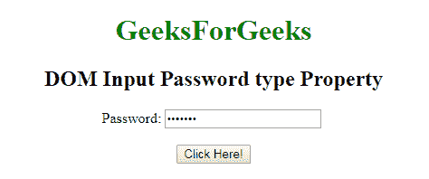
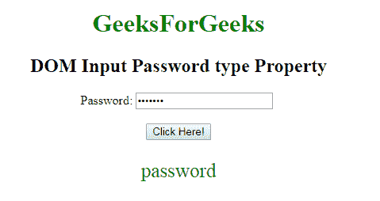

# HTML | DOM 输入密码类型属性

> 原文:[https://www . geesforgeks . org/html-DOM-input-password-type-property/](https://www.geeksforgeeks.org/html-dom-input-password-type-property/)

**DOM 输入密码类型属性**用于返回密码字段是哪种类型的表单元素。此属性将始终为输入密码字段返回“密码”。
**语法:**

```html
passwordObject.type
```

**返回值:**返回一个字符串值，代表密码字段的表单元素类型。
下面的程序说明了电子邮件类型属性:
**示例:**返回密码字段的表单元素类型。

## 超文本标记语言

```html
<!DOCTYPE html>
<html>

<body style="text-align:center;">

    <h1 style="color:green;">
            GeeksForGeeks
        </h1>

    <h2>DOM Input Password type Property</h2> Password:
    <input type="password"
        id="myPsw"
        value="geeks12">
      <br><br>
    <button onclick="myFunction()">
    Click Here!
</button>

    <p id="demo" style="color:green;font-size:25px;"></p>

    <script>
        function myFunction() {
            var x =
            document.getElementById(
            "myPsw").type;

            document.getElementById(
            "demo").innerHTML = x;
        }
    </script>

</body>

</html>
```

**输出:**
**点击按钮前:**



**点击按钮后:**



**支持的浏览器:**T2 DOM 输入密码类型属性支持的浏览器如下:

*   谷歌 Chrome
*   微软公司出品的 web 浏览器
*   火狐浏览器
*   歌剧
*   旅行队