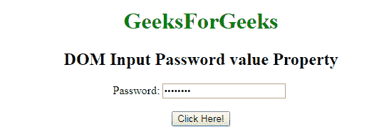
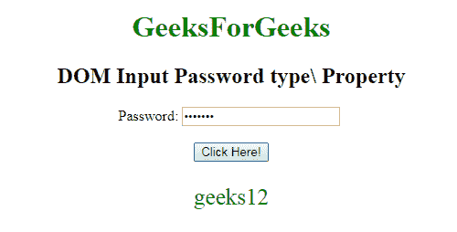
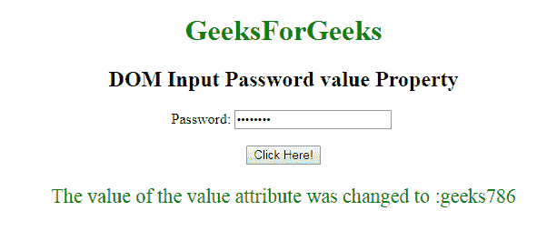

# HTML | DOM 输入密码值属性

> 原文:[https://www . geesforgeks . org/html-DOM-input-password-value-property/](https://www.geeksforgeeks.org/html-dom-input-password-value-property/)

**DOM 输入密码值属性**用于设置或返回密码字段的值属性的值。“值”属性指定输入电子邮件字段的初始值。该值可以是单个地址或地址列表。

**语法:**

*   它用于返回 value 属性。

    ```html
    passwordObject.value
    ```

*   它用于设置 value 属性。

    ```html
    passwordObject.value = text
    ```

**属性值:**

*   **文本:**指定密码字段的值。

**返回值:**返回一个代表密码字段密码的字符串值。

**示例-1:** 这个示例说明了如何**返回**属性。

```html
<!DOCTYPE html> 
<html> 

<body style="text-align:center;"> 

    <h1 style="color:green;"> 
            GeeksForGeeks 
        </h1> 

    <h2>DOM Input Password value Property</h2> Password: 
    <input type="password"
        id="myPsw"
        value="geeks12"> 
      <br><br>
    <button onclick="myFunction()"> 
    Click Here! 
</button> 

    <p id="demo" style="color:green;font-size:25px;"></p> 

    <script> 
        function myFunction() { 
            var x = document.getElementById("myPsw").value; 

            document.getElementById("demo").innerHTML = x; 
        } 
    </script> 

</body> 

</html> 
```

**输出:**
**点击按钮前:**

**点击按钮后:**

**示例-2:** 本示例说明如何**设置**属性。

```html
<!DOCTYPE html> 
<html> 

<body style="text-align:center;"> 

    <h1 style="color:green;"> 
            GeeksForGeeks 
        </h1> 

    <h2>DOM Input Password value Property</h2> Password: 
    <input type="password"
        id="myPsw"
        value="geeks12"> 
      <br><br>
    <button onclick="myFunction()"> 
    Click Here! 
</button> 

    <p id="demo" style="color:green;font-size:22px;"></p> 

    <script> 
        function myFunction() { 
            var x = document.getElementById("myPsw").value ="geeks786"

            document.getElementById("demo").innerHTML = 
            "The value of the value attribute was changed to :" + x; 
        } 
    </script> 

</body> 

</html> 
```

**输出:**
**点击按钮前:**

**点击按钮后:**



**支持的浏览器:****DOM 输入密码值属性**支持的浏览器如下:

*   谷歌 Chrome
*   微软公司出品的 web 浏览器
*   火狐浏览器
*   歌剧
*   旅行队