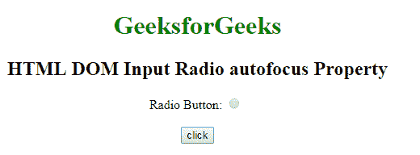
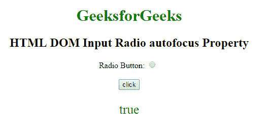
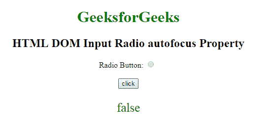

# HTML | DOM 输入单选自动对焦属性

> 原文:[https://www . geesforgeks . org/html-DOM-input-radio-autofocus-property/](https://www.geeksforgeeks.org/html-dom-input-radio-autofocus-property/)

HTML DOM 中的 **DOM 输入单选自动对焦属性**用于**设置**或**返回**页面加载时单选按钮是否自动对焦。此属性用于反映 HTML 自动对焦属性。

**语法:**

*   它返回自动对焦属性。

    ```html
    radioObject.autofocus
    ```

*   它用于设置自动对焦属性。

    ```html
    radioObject.autofocus = true|false 
    ```

**属性值:**

*   **true:** 指定单选按钮获得焦点。
*   **假:**有默认值。它指定单选按钮不能获得焦点。

**返回值:**返回一个布尔值，表示单选按钮是否获得焦点。

**例-1:** 本例说明了如何**归还**房产。

```html
<!DOCTYPE html>
<html>

<head>
    <style>
        body {
            text-align: center;
        }

        h1 {
            color: green;
        }
    </style>
</head>

<body>
    <h1>
      GeeksforGeeks
  </h1>

    <h2>
      HTML DOM Input Radio autofocus Property
  </h2>

    <form id="myGeeks">
        Radio Button:
        <input type="radio"
               id="radioID" 
               value="Geeks_radio"
               name="Geek_radio"
               autofocus>
        <br>
        <br>
    </form>
    <button onclick="GFG()">
        click
    </button>

    <p id="GFG" 
       style="font-size:25px;
              color:green;">
  </p>
    <script>
        function GFG() {
            var x =
                // Accessing input element 
                // type="radio" 
                document.getElementById(
                  "radioID").autofocus;

            document.getElementById(
              "GFG").innerHTML = x;
        }
    </script>

</body>

</html>
```

**输出:**
**点击按钮前:**


**点击按钮后:**


**示例-2:** 这个示例说明了如何**设置**属性。

```html
<!DOCTYPE html>
<html>

<head>
    <style>
        body {
            text-align: center;
        }

        h1 {
            color: green;
        }
    </style>
</head>

<body>
    <h1>
      GeeksforGeeks
  </h1>

    <h2>
      HTML DOM Input Radio autofocus Property
  </h2>

    <form id="myGeeks">
        Radio Button:
        <input type="radio" 
               id="radioID"
               value="Geeks_radio"
               name="Geek_radio" 
               autofocus>
        <br>
        <br>
    </form>
    <button onclick="GFG()">
        click
    </button>

    <p id="GFG"
       style="font-size:25px;
              color:green;">
  </p>
    <script>
        function GFG() {
            var x =
                // Accessing input element 
                // type="radio" 
                document.getElementById(
                  "radioID").autofocus = false;

            document.getElementById(
              "GFG").innerHTML = x;
        }
    </script>

</body>

</html>
```

**输出:**
**点击按钮前:**


**点击按钮后:**


**支持的浏览器:**以下列出的 **DOM 输入 Radio 自动对焦属性**支持的浏览器:

*   谷歌 Chrome
*   Internet Explorer 10.0 +
*   火狐浏览器
*   歌剧
*   旅行队