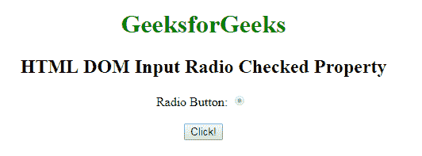
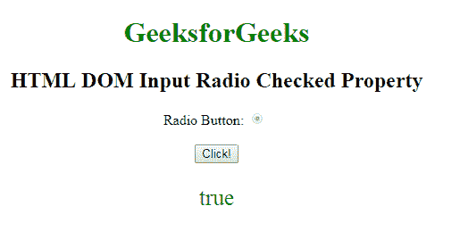
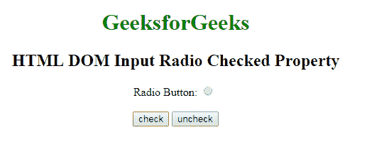
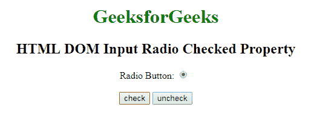
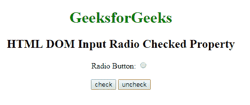

# HTML | DOM 输入单选勾选属性

> 原文:[https://www . geesforgeks . org/html-DOM-input-radio-checked-property/](https://www.geeksforgeeks.org/html-dom-input-radio-checked-property/)

HTML DOM 中的 **DOM 输入单选勾选属性**用于**设置**或**返回** *输入单选按钮*的勾选状态。此属性用于反映 HTML 选中的属性。

**语法:**

*   它返回选中的属性。

    ```html
    radioObject.checked
    ```

*   用于设置勾选属性:

    ```html
    radioObject.checked = true|false
    ```

**属性值:**

*   **true:** 指定勾选了单选按钮。
*   **假:**有默认值。它指定不选中单选按钮。

**返回值:**返回一个布尔值，表示单选按钮是否被选中。

**例-1:** 本例说明了如何**归还**房产。

```html
<!DOCTYPE html>
<html>

<head>
    <style>
        body {
            text-align: center;
        }

        h1 {
            color: green;
        }
    </style>
</head>

<body>
    <h1>
      GeeksforGeeks
  </h1>

    <h2>
      HTML DOM Input Radio Checked Property
  </h2>

    <form id="myGeeks">
        Radio Button:
        <input type="radio" 
               checked=true 
               id="radioID" 
               value="Geeks_radio"
               name="Geek_radio" 
               disabled>
        <br>
        <br>
    </form>
    <button onclick="GFG()">
        Click!
    </button>
    <p id="GFG" 
       style="font-size:25px;
              color:green;">
  </p>
    <script>
        function GFG() {

            // Accessing input element 
            // type="radio" 
            var x =
                document.getElementById(
                  "radioID").defaultChecked;

            document.getElementById(
              "GFG").innerHTML = x;
        }
    </script>

</body>

</html>
```

**输出:**
**点击按钮前:**


**点击按钮后:**


**示例-2:** 本示例说明如何**设置**属性。

```html
<!DOCTYPE html>
<html>

<head>
    <style>
        body {
            text-align: center;
        }

        h1 {
            color: green;
        }
    </style>
</head>

<body>
    <h1>GeeksforGeeks</h1>

    <h2>HTML DOM Input Radio  Checked Property</h2>

    <form id="myGeeks">
        Radio Button:
        <input type="radio"
               id="radioID" 
               value="Geeks_radio" 
               name="Geek_radio" 
               checked>
        <br>
        <br>
    </form>
    <button onclick="GFG()">
        check
    </button>
    <button onclick="uncheck()">
        uncheck
    </button>
    <p id="GFG" 
       style="font-size:25px;
              color:green;">
  </p>
    <script>
        function GFG() {

            // Accessing input element 
            // type="radio" 
            document.getElementById(
              "radioID").checked = "true";
        }

        function uncheck() {
            document.getElementById(
              "radioID").checked = false;
        }
    </script>

</body>

</html>
```

**输出:**
**点击勾选按钮前:**


**点击勾选按钮后:**


**点击后取消勾选按钮:**


**支持的浏览器:**T2 DOM 输入单选勾选属性支持的浏览器如下:

*   谷歌 Chrome
*   Internet Explorer 10.0 +
*   火狐浏览器
*   歌剧
*   旅行队