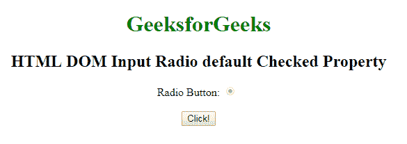
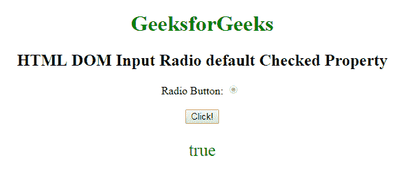

# HTML | DOM 输入单选默认选中属性

> 原文:[https://www . geesforgeks . org/html-DOM-input-radio-default checked-property/](https://www.geeksforgeeks.org/html-dom-input-radio-defaultchecked-property/)

HTML DOM 中的 **DOM 输入单选默认选中属性**用于返回**选中属性**的默认值。如果默认选中单选按钮，则返回 true，否则返回 false。

**语法:**

```html
radioObject.defaultChecked
```

下面的程序说明了如何**返回**属性。
T3】例:

```html
<!DOCTYPE html>
<html>

<head>
    <style>
        body {
            text-align: center;
        }

        h1 {
            color: green;
        }
    </style>
</head>

<body>
    <h1>
      GeeksforGeeks
  </h1>

    <h2>
      HTML DOM Input Radio default Checked Property
  </h2>

    <form id="myGeeks">
        Radio Button:
        <input type="radio" 
               checked=true 
               id="radioID" 
               value="Geeks_radio" 
               name="Geek_radio" 
               disabled>
        <br>
        <br>
    </form>
    <button onclick="GFG()">
        Click!
    </button>
    <p id="GFG"
       style="font-size:25px;
              color:green;">
  </p>
    <script>
        function GFG() {

            // Accessing input element 
            // type="radio" 
            var x =
                document.getElementById(
                  "radioID").defaultChecked;

            document.getElementById(
              "GFG").innerHTML = x;
        }
    </script>

</body>

</html>
```

**输出:**
**点击按钮前:**


**点击按钮后:**


**支持的浏览器:**以下列出的 **DOM 输入单选默认选中属性**支持的浏览器:

*   谷歌 Chrome
*   Internet Explorer 10.0 +
*   火狐浏览器
*   歌剧
*   旅行队