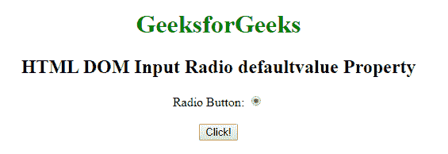
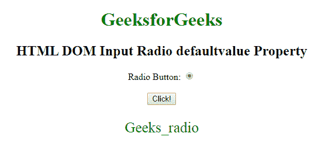
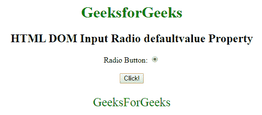

# HTML | DOM 输入单选默认值属性

> 原文:[https://www . geesforgeks . org/html-DOM-input-radio-defaultvalue-property/](https://www.geeksforgeeks.org/html-dom-input-radio-defaultvalue-property/)

HTML DOM 中的**输入单选默认值属性**用于设置或返回单选字段的默认值。此属性用于反映 HTML 值属性。默认值与值的主要区别在于，默认值表示默认值，值包含一些更改后的当前值。此属性对于确定日期字段是否已更改非常有用。

**语法:**

*   它返回 defaultValue 属性。

    ```html
    RadioObject.defaultValue
    ```

*   它用于设置 defaultValue 属性。

    ```html
    RadioObject.defaultValue = value
    ```

**属性值:**包含单个属性值**值**，定义输入单选字段的默认值。

**返回值:**返回一个字符串值，代表输入单选字段的默认值。

**示例 1:** 本示例说明如何返回输入单选默认值属性。

```html
<!DOCTYPE html> 
<html> 

<head> 
    <style> 
        body { 
            text-align: center; 
        } 
        h1 { 
            color: green; 
        } 
    </style> 
</head> 

<body> 
    <h1>GeeksforGeeks</h1> 

    <h2> 
        HTML DOM Input Radio defaultvalue Property 
    </h2> 

    Radio Button: 
    <input type="radio" checked=true id="radioID"
        value="Geeks_radio"> 

    <br><br> 

    <button onclick="GFG()"> 
        Click! 
    </button> 

    <p id="GFG" style=
        "font-size:25px;color:green;"> 
    </p>

    <script> 
        function GFG() { 

            // Accessing input element 
            // type="radio" 
            var x = document.getElementById( 
                    "radioID").defaultValue; 

            document.getElementById( 
                    "GFG").innerHTML = x; 
        } 
    </script> 
</body> 

</html>
```

**输出:**

*   **点击按钮前:**
    
*   **点击按钮后:**
    

**示例 2:** 本示例说明如何设置输入单选默认值属性。

```html
<!DOCTYPE html> 
<html> 

<head> 
    <style> 
        body { 
            text-align: center; 
        } 
        h1 { 
            color: green; 
        } 
    </style> 
</head> 

<body> 
    <h1>GeeksforGeeks</h1> 

    <h2> 
        HTML DOM Input Radio defaultvalue Property 
    </h2> 

    Radio Button: 
    <input type="radio" checked=true id="radioID"
                value="Geeks_radio"> 
    <br><br> 

    <button onclick="GFG()"> 
        Click! 
    </button> 

    <p id="GFG" style=
        "font-size:25px;color:green;"> 
    </p> 

    <script> 
        function GFG() { 

            // Accessing input element 
            // type="radio" 
            var x = document.getElementById("radioID"
                    ).defaultValue = "GeeksForGeeks"; 

            document.getElementById("GFG").innerHTML
                    = x; 
        } 
    </script> 
</body> 

</html>
```

**输出:**

*   **点击按钮前:**
    
*   **点击按钮后:**
    

**支持的浏览器:**T2 DOM 输入单选默认值属性支持的浏览器如下:

*   谷歌 Chrome
*   微软公司出品的 web 浏览器
*   火狐浏览器
*   苹果 Safari
*   歌剧