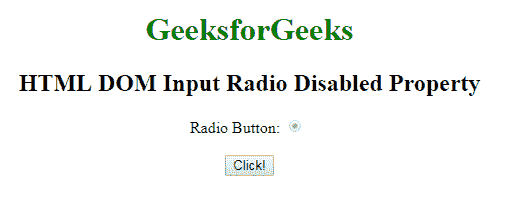
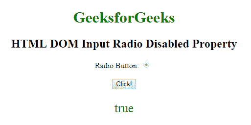
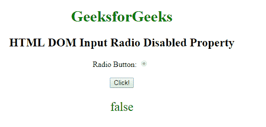

# HTML | DOM 输入单选禁用属性

> 原文:[https://www . geesforgeks . org/html-DOM-input-radio-disabled-property/](https://www.geeksforgeeks.org/html-dom-input-radio-disabled-property/)

**DOM 输入单选禁用属性**用于**设置**或**返回** *单选按钮是否必须禁用*。禁用的单选按钮不可点击且不可用。它是一个布尔属性，用于反映 HTML 禁用属性。在所有浏览器中，默认情况下，它通常呈现为灰色。

**语法:**

*   它返回禁用的属性。

    ```html
    radioObject.disabled
    ```

*   它用于设置禁用属性。

    ```html
    radioObject.disabled = true|false
    ```

**属性值:**

*   **真:**定义输入单选按钮被禁用。
*   **False:** 有默认值。它定义单选按钮未被禁用。

**返回值:**返回一个布尔值，表示单选按钮是否被禁用。

**示例-1:** 本示例说明如何返回属性。

```html
<!DOCTYPE html>
<html>

<head>
    <style>
        body {
            text-align: center;
        }

        h1 {
            color: green;
        }
    </style>
</head>

<body>
    <h1>
      GeeksforGeeks
  </h1>

    <h2>
      HTML DOM Input Radio Disabled Property
  </h2>

    <form id="myGeeks">
        Radio Button:
        <input type="radio" 
               checked=true
               id="radioID" 
               value="Geeks_radio"
               name="Geek_radio" 
               disabled>
        <br>
        <br>
    </form>
    <button onclick="GFG()">
        Click!
    </button>
    <p id="GFG" 
       style="font-size:25px;
              color:green;">
  </p>
    <script>
        function GFG() {

            // Accessing input element 
            // type="radio" 
            var x =
                document.getElementById(
                  "radioID").disabled;

            document.getElementById(
              "GFG").innerHTML = x;
        }
    </script>

</body>

</html>
```

**输出:**
**点击按钮前:**


**点击按钮后:**


**示例-2:** 本示例说明如何**设置**禁用属性。

```html
<!DOCTYPE html>
<html>

<head>
    <style>
        body {
            text-align: center;
        }

        h1 {
            color: green;
        }
    </style>
</head>

<body>
    <h1>
      GeeksforGeeks
  </h1>

    <h2>
      HTML DOM Input Radio Disabled Property
  </h2>

    <form id="myGeeks">
        Radio Button:
        <input type="radio"
               checked=true 
               id="radioID"
               value="Geeks_radio" 
               name="Geek_radio" 
               disabled>
        <br>
        <br>
    </form>
    <button onclick="GFG()">
        Click!
    </button>
    <p id="GFG" 
       style="font-size:25px;
              color:green;">
  </p>
    <script>
        function GFG() {

            // Accessing input element 
            // type="radio" 
            var x =
                document.getElementById(
                  "radioID").disabled = "false";

            document.getElementById(
              "GFG").innerHTML = x;
        }
    </script>

</body>

</html>
```

**输出:**
**点击按钮前:**


**点击按钮后:**


**支持的浏览器:**T2 DOM 输入无线电禁用属性支持的浏览器如下:

*   谷歌 Chrome
*   Internet Explorer 10.0 +
*   火狐浏览器
*   歌剧
*   旅行队