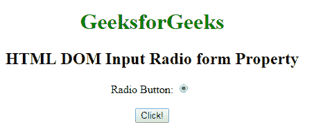
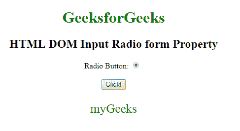

# HTML | DOM 输入单选表单属性

> 原文:[https://www . geesforgeks . org/html-DOM-input-radio-form-property/](https://www.geeksforgeeks.org/html-dom-input-radio-form-property/)

HTML 中的 **DOM 输入单选按钮表单属性**用于**返回** *包含单选按钮*的表单的引用。它是一个只读属性，在成功时返回一个表单对象。
**语法:**

```html
radioObject.form 
```

**返回值**:返回一个字符串值，该值指定包含输入单选字段的表单的引用

**示例:**下面的程序说明了输入无线电表单属性。

## 超文本标记语言

```html
<!DOCTYPE html>
<html>

<head>
    <style>
        body {
            text-align: center;
        }

        h1 {
            color: green;
        }
    </style>
</head>

<body>
    <h1>
      GeeksforGeeks
  </h1>

    <h2>
      HTML DOM Input Radio form Property
  </h2>

    <form id="myGeeks">
        Radio Button:
        <input type="radio"
               checked=true
               id="radioID"
               value="Geeks_radio"
               name="Geek_radio">
        <br>
        <br>
    </form>
    <button onclick="GFG()">
        Click!
    </button>
    <p id="GFG"
       style="font-size:25px;
              color:green;">
  </p>

    <script>
        function GFG() {

            // Accessing input element
            // type="radio"
            var x =
                document.getElementById(
                  "radioID").form.id;

            document.getElementById(
              "GFG").innerHTML = x;
        }
    </script>

</body>

</html>
```

**输出:**
**点击按钮前:**



**点击按钮后:**



**支持的浏览器:**T2 DOM 输入单选表单属性支持的浏览器如下:

*   谷歌 Chrome
*   Internet Explorer 10.0 +
*   火狐浏览器
*   歌剧
*   旅行队