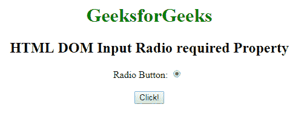
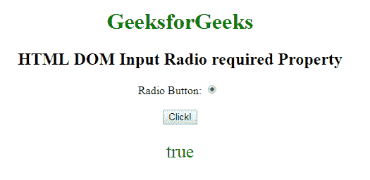
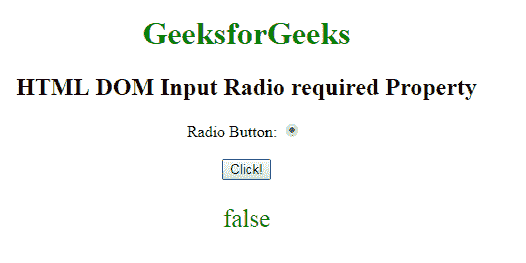

# HTML | DOM 输入单选必填属性

> 原文:[https://www . geesforgeks . org/html-DOM-input-radio-required-property/](https://www.geeksforgeeks.org/html-dom-input-radio-required-property/)

HTML DOM 中的 **DOM 输入单选必填属性**用于**设置**或**返回**提交表单时是否勾选*输入单选字段。此属性用于反映 HTML 必需的属性。*

**语法:**

*   它返回需要输入无线电的属性。

    ```html
    radioObject.required
    ```

*   它用于设置输入无线电所需的属性。

    ```html
    radioObject.required = true|false
    ```

**属性值:**

*   **true:** 指定在提交表单之前必须签出单选字段。
*   **false:** 为默认值。它指定在提交表单之前不得签出“无线电”字段。

**返回值:**返回一个布尔值，表示在提交表单之前是否必须检查单选字段。

**示例-1:** 本示例说明如何返回 Input Radio 必需属性。

```html
<!DOCTYPE html>
<html>

<head>
    <style>
        body {
            text-align: center;
        }

        h1 {
            color: green;
        }
    </style>
</head>

<body>
    <h1>
      GeeksforGeeks
  </h1>

    <h2>
      HTML DOM Input Radio required Property
  </h2> 
  Radio Button:
    <input type="radio"
           checked=true 
           id="radioID"
           value="Geeks_radio"
           required>
    <br>
    <br>
    <button onclick="GFG()">
        Click!
    </button>
    <p id="GFG" 
       style="font-size:25px;
              color:green;">
  </p>
    <script>
        function GFG() {

            // Accessing input element 
            // type="radio" 
            var x =
                document.getElementById(
                  "radioID").required;

            document.getElementById(
              "GFG").innerHTML = x;
        }
    </script>

</body>

</html>
```

**输出:**
**点击按钮前:**


**点击按钮后:**


**示例-2:** 本示例说明如何**设置**输入无线电所需属性。

```html
<!DOCTYPE html>
<html>

<head>
    <style>
        body {
            text-align: center;
        }

        h1 {
            color: green;
        }
    </style>
</head>

<body>
    <h1>
      GeeksforGeeks
  </h1>

    <h2>
      HTML DOM Input Radio required Property
  </h2> 
  Radio Button:
    <input type="radio"
           checked=true
           id="radioID"
           value="Geeks_radio"
           required>
    <br>
    <br>
    <button onclick="GFG()">
        Click!
    </button>
    <p id="GFG" 
       style="font-size:25px;
              color:green;">
  </p>
    <script>
        function GFG() {

            // Accessing input element 
            // type="radio" 
            var x =
                document.getElementById(
                  "radioID").required = "false";

            document.getElementById(
              "GFG").innerHTML = x;
        }
    </script>

</body>

</html>
```

**输出:**
**点击按钮前:**


**点击按钮后:**


**支持的浏览器:****DOM 输入单选所需属性**支持的浏览器如下:

*   谷歌 Chrome
*   Internet Explorer 10.0 +
*   火狐浏览器
*   歌剧
*   旅行队