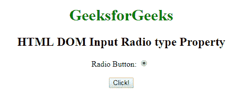
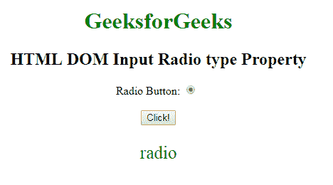

# HTML | DOM 输入单选类型属性

> 原文:[https://www . geesforgeks . org/html-DOM-input-radio-type-property/](https://www.geeksforgeeks.org/html-dom-input-radio-type-property/)

HTML DOM 中的 **DOM 输入单选类型属性**用于**返回** *单选按钮*的表单元素类型。它总是返回输入单选按钮的提交。
**语法:**

```html
radioObject.type
```

**返回值:**它返回一个字符串值，该值代表输入单选字段的表单元素类型。

**下面的程序说明了 HTML DOM 中的 Radio 类型属性:**
**示例:**本示例返回 Radio 字段的表单元素的类型。

## 超文本标记语言

```html
<!DOCTYPE html>
<html>

<head>
    <style>
        body {
            text-align: center;
        }

        h1 {
            color: green;
        }
    </style>
</head>

<body>
    <h1>
      GeeksforGeeks
  </h1>

    <h2>
      HTML DOM Input Radio type Property
  </h2>
  Radio Button:
    <input type="radio"
           checked=true
           id="radioID"
           value="Geeks_radio"
           name="Geek_radio">
    <br>
    <br>
    <button onclick="GFG()">
        Click!
    </button>
    <p id="GFG"
       style="font-size:25px;
              color:green;">
  </p>

    <script>
        function GFG() {

            // Accessing input element
            // type="radio"
            var x =
                document.getElementById(
                  "radioID").type;

            document.getElementById(
              "GFG").innerHTML = x;
        }
    </script>

</body>

</html>
```

**输出:**
**点击按钮前:**



**点击按钮后:**



**支持的浏览器:**T2 DOM 输入单选类型属性支持的浏览器如下:

*   谷歌 Chrome
*   Internet Explorer 10.0 +
*   火狐浏览器
*   歌剧
*   旅行队