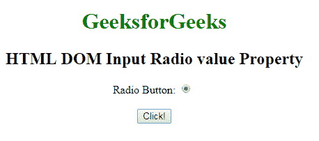
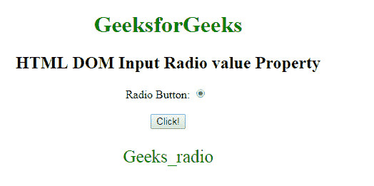
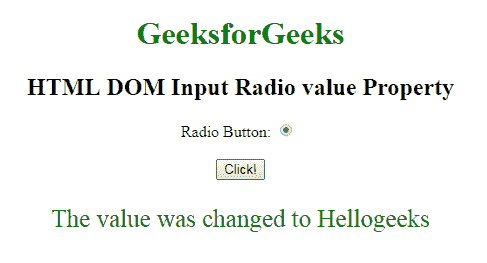

# HTML | DOM 输入单选值属性

> 原文:[https://www . geesforgeks . org/html-DOM-input-radio-value-property/](https://www.geeksforgeeks.org/html-dom-input-radio-value-property/)

HTML DOM 中的 **DOM 输入单选值属性**用于**设置**或**返回** *输入单选字段*的值。该属性指定默认值或用户类型值。

**语法:**

*   它返回 value 属性。

    ```html
    radioObject.value
    ```

*   它用于设置 value 属性。

    ```html
    radioObject.value = number
    ```

**属性值:**它包含一个值，即与输入单选字段相关联的值。

**返回值:**返回一个字符串值，代表**单选按钮的值属性的值。**

**示例-1:** 本示例说明了如何**返回**值属性。

```html
<!DOCTYPE html>
<html>

<head>
    <style>
        body {
            text-align: center;
        }

        h1 {
            color: green;
        }
    </style>
</head>

<body>
    <h1>GeeksforGeeks</h1>

    <h2>
      HTML DOM Input Radio value Property
  </h2>
  Radio Button:
    <input type="radio"
           checked=true 
           id="radioID"
           value="Geeks_radio">
    <br>
    <br>
    <button onclick="GFG()">
        Click!
    </button>
    <p id="GFG" 
       style="font-size:25px;
              color:green;">
  </p>
    <script>
        function GFG() {

            // Accessing input element 
            // type="radio" 
            var x =
                document.getElementById(
                  "radioID").value;

            document.getElementById(
              "GFG").innerHTML = x;
        }
    </script>

</body>

</html>
```

**输出:**
**点击按钮前:**


**点击按钮后:**


**示例-2:** 本示例说明如何**设置**属性。

```html
<!DOCTYPE html>
<html>

<head>
    <style>
        body {
            text-align: center;
        }

        h1 {
            color: green;
        }
    </style>
</head>

<body>
    <h1>GeeksforGeeks</h1>

    <h2>
      HTML DOM Input Radio value Property
  </h2>
  Radio Button:
    <input type="radio" 
           checked=true 
           id="radioID" 
           value="Geeks_radio">
    <br>
    <br>
    <button onclick="GFG()">
        Click!
    </button>
    <p id="GFG" 
       style="font-size:25px;
              color:green;">
  </p>
    <script>
        function GFG() {

            // Accessing input element 
            // type="radio" 
            var x =
                document.getElementById(
                  "radioID").value = "Hellogeeks";

            document.getElementById(
              "GFG").innerHTML = 
              "The value was changed to " + x;
        }
    </script>

</body>

</html>
```

**输出:**
**点击按钮前:**


**点击按钮后:**


**支持的浏览器:****DOM 输入单选值属性**支持的浏览器如下:

*   谷歌 Chrome
*   Internet Explorer 10.0 +
*   火狐浏览器
*   歌剧
*   旅行队