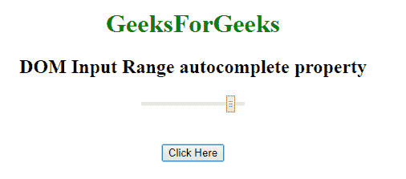
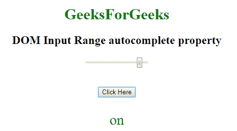
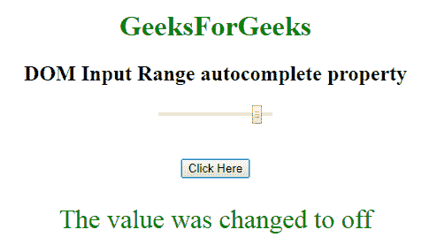

# HTML | DOM 输入范围自动完成属性

> 原文:[https://www . geesforgeks . org/html-DOM-input-range-autocomplete-property/](https://www.geeksforgeeks.org/html-dom-input-range-autocomplete-property/)

HTML DOM 中的**输入范围自动完成属性**用于设置或返回输入范围字段的自动完成属性的值。自动完成属性用于指定自动完成属性的值是“开”还是“关”。当“自动完成”属性设置为“开”时，浏览器将根据用户之前输入的值自动完成。

**语法:**

*   它返回输入范围自动完成属性。

    ```html
    rangeObject.autocomplete
    ```

*   它用于设置输入范围自动完成属性。

    ```html
    rangeObject.autocomplete = "on | off" 
    ```

**属性值:**包含以下两个值:

*   **开:**为默认值。它会自动完成这些值。
*   **off:** 定义用户应填写 URL 输入字段的值。它不会自动完成这些值。

**返回值:**返回一个代表自动完成状态的字符串值。

**示例 1:** 本示例说明如何返回输入范围自动完成属性。

```html
<!DOCTYPE html> 
<html> 

<head> 
    <title> 
        HTML DOM Input range autocomplete Property 
    </title> 

    <style> 
        #Geek_p { 
            font-size: 30px; 
            color: green; 
        } 
    </style> 
</head>

<body style="text-align:center;"> 

    <h1 style="color:green;"> 
        GeeksForGeeks 
    </h1> 

    <h2>DOM Input Range autocomplete property</h2> 

    <form id="geeks"> 
        <input name="Geek_range" type="range"
            id="Geek_Range" value="90"
            autocomplete="on"> 
    </form>

    <br><br> 

    <button onclick="myGeeks()"> 
        Click Here 
    </button> 

    <p id="Geek_p"></p> 

    <script> 
        function myGeeks() { 

            // Return autocomplete property. 
            var x =document.getElementById( 
                "Geek_Range").autocomplete; 

            document.getElementById( 
                "Geek_p").innerHTML = x; 
        } 
    </script> 
</body> 

</html>
```

**输出:**

*   **点击按钮前:**
    
*   **点击按钮后:**
    

**示例 2:** 本示例说明如何设置输入范围自动完成属性。

```html
<!DOCTYPE html> 
<html> 

<head> 
    <title> 
        HTML DOM Input range autocomplete Property 
    </title> 

    <style> 
        #Geek_p { 
            font-size: 30px; 
            color: green; 
        } 
    </style> 
</head>

<body style="text-align:center;"> 

    <h1 style="color:green;"> 
        GeeksForGeeks 
    </h1> 

    <h2>DOM Input Range autocomplete property</h2> 

    <form id="geeks"> 
        <input name="Geek_range" type="range"
            id="Geek_Range" value="90"
            autocomplete="on"> 
    </form>

    <br><br> 

    <button onclick="myGeeks()"> 
        Click Here 
    </button> 

    <p id="Geek_p"></p> 

    <script> 
        function myGeeks() { 

            // Return autocomplete property. 
            var x = document.getElementById( 
                "Geek_Range").autocomplete = "of"; 

            document.getElementById("Geek_p").innerHTML
                = "The value was changed to " + x; 
        } 
    </script> 
</body> 

</html>
```

**输出:**

*   **点击按钮前:**
    
*   **点击按钮后:**
    

**支持的浏览器:****HTML DOM 输入范围自动完成属性**支持的浏览器如下:

*   谷歌 Chrome
*   微软公司出品的 web 浏览器
*   火狐浏览器
*   苹果 Safari
*   歌剧