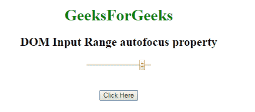
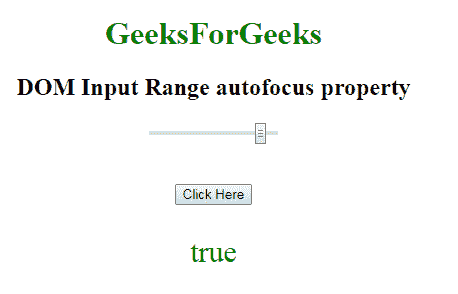
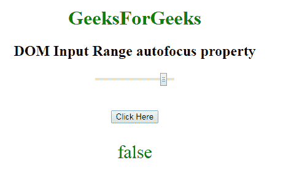

# HTML | DOM 输入范围自动对焦属性

> 原文:[https://www . geesforgeks . org/html-DOM-input-range-autofocus-property/](https://www.geeksforgeeks.org/html-dom-input-range-autofocus-property/)

HTML DOM 中的 **DOM 输入范围自动对焦属性**用于**设置**或**返回**页面加载时输入范围字段是否应该对焦。它反映了 HTML 自动对焦属性。

**语法:**

*   它返回自动对焦属性。

```html
rangeObject.autofocus
```

*   它用于设置自动对焦属性。

```html
rangeObject.autofocus = "true|false"
```

**属性值:**

*   **true:** 设置范围场的焦点。
*   **假:**有默认值。它定义了范围字段不能获得焦点。

**返回值:**返回一个布尔值，代表范围或滑块控制字段是否自动对焦。
**示例-1:** 本示例返回输入范围自动对焦属性。

## 超文本标记语言

```html
<!DOCTYPE html>
<html>

<head>
    <title>
        HTML DOM Input range autofocus Property
    </title>
</head>
<style>
    #Geek_p {
        font-size: 30px;
        color: green;
    }
</style>

<body style="text-align:center;">

    <h1 style="color:green;">
            GeeksForGeeks
        </h1>

    <h2>DOM Input Range autofocus property
  </h2>
    <form id="geeks">
        <input name=G
               eek_range
               type="range"
               id="Geek_Range"
               value="90"
               autofocus>
    </form>
    <br>
    <br>
    <button onclick="myGeeks()">
        Click Here
    </button>
    <p id="Geek_p">
  </p>

    <script>
        function myGeeks() {

            //Return autofoucs property.
            var x =
            document.getElementById(
              "Geek_Range").autofocus;

            document.getElementById(
              "Geek_p").innerHTML = x;
        }
    </script>
</body>

</html>
```

**输出:**
**点击按钮前:**



**点击按钮后:**



**示例-2:** 该示例说明了如何**设置**自动对焦属性。

## 超文本标记语言

```html
<!DOCTYPE html>
<html>

<head>
    <title>
        HTML DOM Input range autofocus Property
    </title>
</head>
<style>
    #Geek_p {
        font-size: 30px;
        color: green;
    }
</style>

<body style="text-align:center;">

    <h1 style="color:green;">
            GeeksForGeeks
        </h1>

    <h2>
      DOM Input Range autofocus property
  </h2>
    <form id="geeks">
        <input name=G
               eek_range
               type="range"
               id="Geek_Range"
               value="90"
               autofocus>
    </form>
    <br>
    <br>
    <button onclick="myGeeks()">
        Click Here
    </button>
    <p id="Geek_p"></p>

    <script>
        function myGeeks() {

            // Set autofocus property.
            var x =
             document.getElementById(
               "Geek_Range").autofocus = false;

            document.getElementById(
              "Geek_p").innerHTML = x;
        }
    </script>
</body>

</html>
```

**输出:**
**点击按钮前:**


**点击按钮后:**



**支持的浏览器:**T2 DOM 输入范围自动对焦属性支持的浏览器如下:

*   谷歌 Chrome
*   Internet Explorer 10.0 +
*   火狐浏览器
*   歌剧
*   旅行队