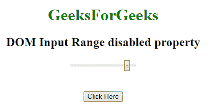
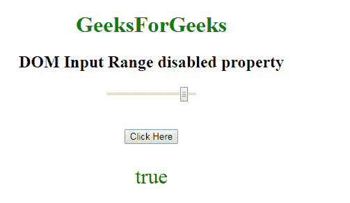
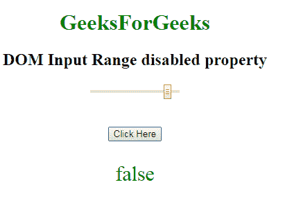

# HTML | DOM 输入范围禁用属性

> 原文:[https://www . geesforgeks . org/html-DOM-input-range-disabled-property/](https://www.geeksforgeeks.org/html-dom-input-range-disabled-property/)

**DOM 输入范围禁用属性**用于**设置**或**返回**输入范围字段是否必须禁用。禁用的范围字段不可点击且不可用。它是一个布尔属性，用于反映 HTML 禁用属性。在所有浏览器中，默认情况下，它通常呈现为灰色。

**语法:**

*   它返回禁用的属性。

```html
rangeObject.disabled
```

*   它用于设置禁用属性。

```html
rangeObject.disabled = true|false
```

**属性值:**

*   **真:**定义输入范围字段被禁用。
*   **False:** 有默认值。它定义输入范围字段未被禁用。

**返回值:**返回一个布尔值，表示输入范围字段是否被禁用。
**例-1:** 此例说明如何归还房产。

## 超文本标记语言

```html
<!DOCTYPE html>
<html>

<head>
    <title>
        HTML DOM Input Range disabled Property
    </title>
</head>
<style>
    #Geek_p {
        font-size: 30px;
        color: green;
    }
</style>

<body style="text-align:center;">

    <h1 style="color:green;">
            GeeksForGeeks
        </h1>

    <h2>
      DOM Input Range disabled property
  </h2>
    <form id="geeks">
        <input name=G
               eek_range type="range"
               id="Geek_Range"
               value="90"
               disabled>
    </form>
    <br>
    <br>
    <button onclick="myGeeks()">
        Click Here
    </button>
    <p id="Geek_p"></p>

    <script>
        function myGeeks() {

            // Return input range property.
            var x =
            document.getElementById(
              "Geek_Range").disabled;

            document.getElementById(
              "Geek_p").innerHTML = x;
        }
    </script>
</body>

</html>
```

**输出:**
**点击按钮前:**



**点击按钮后:**



**示例-2:** 本示例说明如何**设置**属性。

## 超文本标记语言

```html
<!DOCTYPE html>
<html>

<head>
    <title>
        HTML DOM Input Range disabled Property
    </title>
</head>
<style>
    #Geek_p {
        font-size: 30px;
        color: green;
    }
</style>

<body style="text-align:center;">

    <h1 style="color:green;">
            GeeksForGeeks
        </h1>

    <h2>
      DOM Input Range disabled property
  </h2>
    <form id="geeks">
        <input name=G
               eek_range type="range"
               id="Geek_Range"
               value="90"
               disabled>
    </form>
    <br>
    <br>
    <button onclick="myGeeks()">
        Click Here
    </button>
    <p id="Geek_p">
  </p>

    <script>
        function myGeeks() {

            //  Set input range disabled property
            var x =
                document.getElementById(
                "Geek_Range").disabled = false;

            document.getElementById(
              "Geek_p").innerHTML = x;
        }
    </script>
</body>

</html>
```

**输出:**
**点击按钮前:**


**点击按钮后:**



**支持的浏览器:**禁用属性的 **DOM 输入范围支持的浏览器如下:**

*   谷歌 Chrome
*   Internet Explorer 10.0 +
*   火狐浏览器
*   歌剧
*   旅行队