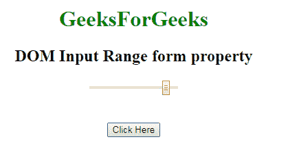
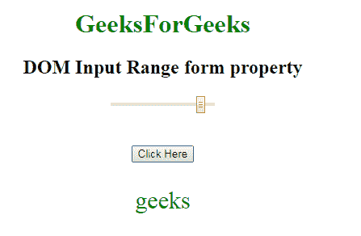

# HTML | DOM 输入范围表单属性

> 原文:[https://www . geesforgeks . org/html-DOM-input-range-form-property/](https://www.geeksforgeeks.org/html-dom-input-range-form-property/)

HTML DOM 中的 **DOM 输入范围表单属性**用于**返回** *包含输入范围字段*的表单的引用。它是一个只读属性，在成功时返回表单对象。
**语法:**

```html
rangeObject.form
```

**返回值:**它返回一个字符串值，指定包含输入范围字段的表单的引用。

**例:**本例说明如何将**返回** **输入范围形成**属性。

## 超文本标记语言

```html
<!DOCTYPE html>
<html>

<head>
    <title>
        HTML DOM Input Range form Property
    </title>
</head>
<style>
    #Geek_p {
        font-size: 30px;
        color: green;
    }
</style>

<body style="text-align:center;">

    <h1 style="color:green;">
            GeeksForGeeks
        </h1>

    <h2>DOM Input Range form property
  </h2>
    <form id="geeks">
        <input name=G
               eek_range type="range"
               id="Geek_Range"
               value="90">
    </form>
    <br>
    <br>
    <button onclick="myGeeks()">
        Click Here
    </button>
    <p id="Geek_p"></p>

    <script>
        function myGeeks() {

            // Return the form id.
            var x =
                document.getElementById(
                  "Geek_Range").form.id;

            document.getElementById(
              "Geek_p").innerHTML = x;
        }
    </script>
</body>

</html>
```

**输出:**
**点击按钮前:**



**点击按钮后:**



**支持的浏览器:**T2 DOM 输入范围表单属性支持的浏览器如下:

*   谷歌 Chrome
*   微软公司出品的 web 浏览器
*   火狐浏览器
*   歌剧
*   旅行队