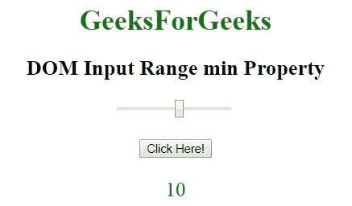
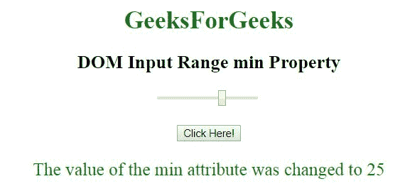

# HTML | DOM 输入范围最小属性

> 原文:[https://www . geesforgeks . org/html-DOM-input-range-min-property/](https://www.geeksforgeeks.org/html-dom-input-range-min-property/)

HTML DOM 中的**输入范围最小属性**用于**设置**或**返回** *滑块控件*的最小属性值。min 属性用于指定滑块控件的最小值。

**语法:**

*   **返回输入范围最小属性:**

    ```html
    rangeObject.min
    ```

*   **用于设置输入范围最小属性:**

    ```html
    rangeObject.min = number
    ```

**属性值:**它包含单个值**数字**，指定滑块控件允许的最小值。

**返回值:**返回一个代表最小允许值的字符串。

**示例-1:**

```html
<!DOCTYPE html>
<html>

<head>
    <title>
        DOM Input Range min Property
    </title>
</head>

<body style="text-align:center;">

    <h1 style="color:green;"> 
            GeeksForGeeks 
        </h1>

    <h2>
      DOM Input Range min Property
  </h2>

    <input type="range" 
           id="myRange" 
           min="10" 
           max="50">

    <br>
    <br>

    <button onclick="myGeeks()">
        Click Here!
    </button>

    <p id="GFG" 
       style="font-size:23px;
              color:green;">
  </p>

    <script>
        function myGeeks() {

            // Accessing input value 
            var x =
                document.getElementById(
                  "myRange").min;

            document.getElementById(
              "GFG").innerHTML = x;
        }
    </script>

</body>

</html>
```

**输出:**
**点击按钮前:**

**点击按钮后:**


**示例-2:**

```html
<!DOCTYPE html>
<html>

<head>
    <title>
        DOM Input Range min Property
    </title>
</head>

<body style="text-align:center;">

    <h1 style="color:green;"> 
            GeeksForGeeks 
        </h1>

    <h2>
      DOM Input Range min Property
  </h2>

    <input type="range" 
           id="myRange" 
           min="10" 
           max="50">

    <br>
    <br>

    <button onclick="myGeeks()">
        Click Here!
    </button>

    <p id="GFG" 
       style="font-size:23px;
              color:green;">
  </p>

    <script>
        function myGeeks() {

            // Accessing input value  
            var x =
                document.getElementById(
                  "myRange").min = "25";

            document.getElementById(
              "GFG").innerHTML =
                "The value of the min attribute"+
              " was changed to " + x;
        }
    </script>

</body>

</html>
```

**输出:**
**点击按钮前:**

**点击按钮后:**


**支持的浏览器:**T2 DOM 输入范围最小属性支持的浏览器如下:

*   谷歌 Chrome
*   Internet Explorer 10.0
*   火狐浏览器
*   旅行队
*   歌剧