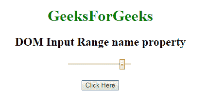
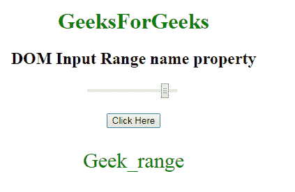
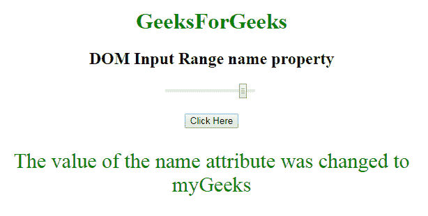

# HTML | DOM 输入范围名称属性

> 原文:[https://www . geesforgeks . org/html-DOM-input-range-name-property/](https://www.geeksforgeeks.org/html-dom-input-range-name-property/)

HTML DOM 中的 **DOM 输入范围名称属性**用于**设置**或**返回** *范围字段*的名称属性值。每个输入字段都需要名称属性。如果没有在输入字段中指定 name 属性，则根本不会发送该字段的数据。

**语法:**

*   它返回输入数字范围属性。

    ```html
    rangeObject.name
    ```

*   它用于设置输入范围名称属性。

    ```html
    rangeObject.name = name
    ```

**属性值:**它包含定义范围字段名称的单个值名称。

**返回值:**返回一个代表范围字段名称的字符串值。

**示例-1:** 本示例说明如何返回输入范围名称属性。

```html
<!DOCTYPE html>
<html>

<head>
    <title>
        HTML DOM Input range name Property
    </title>
</head>
<style>
    #Geek_p {
        font-size: 30px;
        color: green;
    }
</style>

<body style="text-align:center;">

    <h1 style="color:green;"> 
            GeeksForGeeks 
        </h1>

    <h2>DOM Input Range name property 
  </h2>
    <input name=G 
           eek_range type="range"
           id="Geek_Range" 
           value="90">
    <br>
    <br>
    <button onclick="myGeeks()">
        Click Here
    </button>
    <p id="Geek_p"></p>
    <script>
        function myGeeks() {

            // Return name property.
            var x = 
                document.getElementById(
                  "Geek_Range").name;

            document.getElementById(
              "Geek_p").innerHTML = x;
        }
    </script>
</body>

</html>
```

**输出:**
**点击按钮前:**


**点击按钮后:**


**示例-2:** 这个示例说明了如何**设置**名称属性。

```html
<!DOCTYPE html>
<html>

<head>
    <title>
        HTML DOM Input range name Property
    </title>
</head>
<style>
    #Geek_p {
        font-size: 30px;
        color: green;
    }
</style>

<body style="text-align:center;">

    <h1 style="color:green;"> 
            GeeksForGeeks 
        </h1>

    <h2>DOM Input Range name property 
  </h2>
    <input name=G
           eek_range type="range" 
           id="Geek_Range" 
           value="90">
    <br>
    <br>
    <button onclick="myGeeks()">
        Click Here
    </button>
    <p id="Geek_p"></p>
    <script>
        function myGeeks() {

            // Set name property.
            var x =
                document.getElementById(
                  "Geek_Range").name = "myGeeks";

            document.getElementById("Geek_p").innerHTML =
              "The value of the name"+
              " attribute was changed to " + x;
        }
    </script>
</body>

</html>
```

**输出:**

**点击按钮前:**


**点击按钮后:**


**支持的浏览器:****DOM 输入范围名称属性**支持的浏览器如下:

*   谷歌 Chrome
*   Internet Explorer 10.0 +
*   火狐浏览器
*   歌剧
*   旅行队