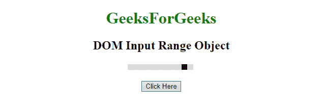
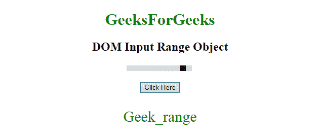
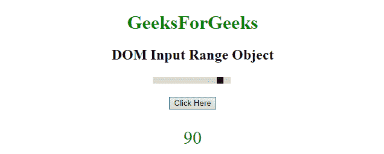
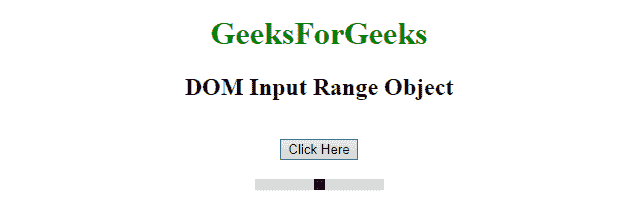

# HTML | DOM 输入范围对象

> 原文:[https://www.geeksforgeeks.org/html-dom-input-range-object/](https://www.geeksforgeeks.org/html-dom-input-range-object/)

HTML DOM 中的**输入范围对象**是用 **type="range"** 表示 HTML [<输入>](https://www.geeksforgeeks.org/html5-date-attribute-in-input-tag/) 元素。

此标签用于**访问**或**创建****<输入>** 元素。可以使用 **getElementById()** 方法访问该元素。

**语法:**

```html
document.getElementById("Input_ID");

```

该输入标识被分配给 HTML <input>元素。

**示例-1:** 使用**文档从**【极客 _ 范围】** id 返回<输入>元素的名称**

```html
<!DOCTYPE html>  
<html>  
    <head> 
        <title> 
            HTML DOM RANGE Object 
        </title> 
    </head> 
    <style>
    #Geek_p{
       font-size:30px;
       color:green;
    }
    </style>
    <body style = "text-align:center;">  

        <h1 style = "color:green;" >  
            GeeksForGeeks  
        </h1>  

        <h2>DOM Input Range Object</h2>  
        <input name = Geek_range 
               type="range"
               id="Geek_Range" 
                value="90">
        <br>
        <br>
        <button onclick = "myGeeks()"> 
            Click Here 
        </button> 
        <p id="Geek_p"></p>
        <script> 
            function myGeeks() {
             var x = document.getElementById("Geek_Range").name;
             document.getElementById("Geek_p").innerHTML = x;
          }
        </script> 
    </body>  
</html> 
```

**输出**

*   **之前点击按钮:**
    
*   **点击按钮后:**
    

**示例-2:** 使用**文档从**【极客 _ 范围】** id 输入>元素的返回值**

```html
<!DOCTYPE html>  
<html>  
    <head> 
        <title> 
            HTML DOM RANGE Object 
        </title> 
    </head> 
    <style>
    #Geek_p{
       font-size:30px;
       color:green;
    }
    </style>
    <body style = "text-align:center;">  

        <h1 style = "color:green;" >  
            GeeksForGeeks  
        </h1>  

        <h2>DOM Input Range Object</h2>  
        <input name = Geek_range 
               type="range" 
               id="Geek_Range" 
               value="90">
        <br>
        <br>
        <button onclick = "myGeeks()"> 
            Click Here 
        </button> 
        <p id="Geek_p"></p>
        <script> 
            function myGeeks() {
             var x = document.getElementById("Geek_Range").value;
             document.getElementById("Geek_p").innerHTML = x;
          }
        </script> 
    </body>  
</html>  
```

**输出**

*   **之前点击按钮:**
    
*   **After click on the button:**
    

    **示例-3:** 创建<用 type = "range "输入>元素。

    ```html
    <!DOCTYPE html>  
    <html>  
        <head> 
            <title> 
                HTML DOM RANGE Object 
            </title> 
        </head> 
        <style>
        </style>
        <body style = "text-align:center;">  

            <h1 style = "color:green;" >  
                GeeksForGeeks  
            </h1>  

            <h2>DOM Input Range Object</h2>  
            <br>
            <button onclick = "myGeeks()"> 
                Click Here 
            </button> 
            <p id="Geek_p"></p>
            <script> 
                function myGeeks() {
                  var x = document.createElement("INPUT");
                  x.setAttribute("type", "range");
                  document.body.appendChild(x);
              }
            </script> 
        </body>  
    </html> 
    ```

    **输出**

    *   **之前点击按钮:**
        
    *   **点击按钮后:**
        

    **支持的浏览器:**

    *   谷歌 Chrome
    *   Mozilla Firefox
    *   边缘
    *   旅行队
    *   歌剧