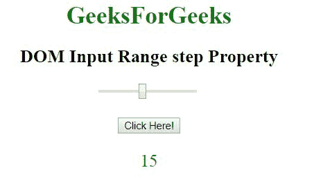
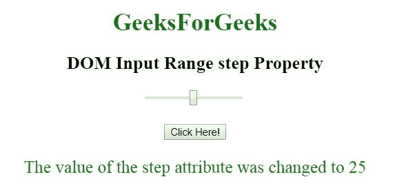

# HTML | DOM 输入范围步骤属性

> 原文:[https://www . geesforgeks . org/html-DOM-input-range-step-property/](https://www.geeksforgeeks.org/html-dom-input-range-step-property/)

HTML DOM 中的 **DOM 输入范围步长属性**用于**设置**或**返回** *滑块控件*的步长属性值。step 属性用于指定两个值之间的空间大小。此属性可以与最小值和最大值一起使用，以创建一个值范围。

**语法:**

*   **返回输入范围步长属性:**

    ```html
    rangeObject.step
    ```

*   **用于设置输入范围步长属性:**

    ```html
    rangeObject.step = number
    ```

**属性值:**包含单值**数**，指定步长大小。步长的默认值是 1。

**返回值:**它返回一个代表值之间增量的数字。

**示例-1:**

```html
<!DOCTYPE html>
<html>

<head>
    <title>
        DOM Input Range step Property
    </title>
</head>

<body style="text-align:center;">

    <h1 style="color:green;"> 
            GeeksForGeeks 
        </h1>

    <h2>
      DOM Input Range step Property
  </h2>

    <input type="range" 
           id="myRange"
           step="15">

    <br>
    <br>

    <button onclick="myGeeks()">
        Click Here!
    </button>

    <p id="GFG" 
       style="font-size:23px;
              color:green;">
  </p>

    <script>
        function myGeeks() {

            // Accessing input value 
            var x =
                document.getElementById(
                  "myRange").step;

            document.getElementById(
              "GFG").innerHTML = x;
        }
    </script>

</body>

</html>
```

**输出:**
**之前点击按钮:**


**点击按钮后:**


**示例-2:**

```html
<!DOCTYPE html>
<html>

<head>
    <title>
        DOM Input Range step Property
    </title>
</head>

<body style="text-align:center;">

    <h1 style="color:green;"> 
            GeeksForGeeks 
        </h1>

    <h2>
      DOM Input Range step Property
  </h2>

    <input type="range"
           id="myRange"
           step="15">

    <br>
    <br>

    <button onclick="myGeeks()">
        Click Here!
    </button>

    <p id="GFG" 
       style="font-size:23px;
              color:green;">
  </p>

    <script>
        function myGeeks() {

            // Accessing input value  
            var x =
                document.getElementById(
                  "myRange").step = "25";

            document.getElementById(
              "GFG").innerHTML =
                "The value of the step attribute"+
              " was changed to " + x;
        }
    </script>

</body>

</html>
```

**输出:**
**之前点击按钮:**


**点击按钮后:**


**支持的浏览器:****DOM 输入范围步长属性**支持的浏览器如下:

*   谷歌 Chrome
*   微软公司出品的 web 浏览器
*   火狐浏览器
*   旅行队
*   歌剧