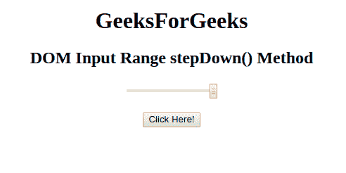
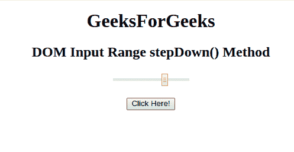

# HTML | DOM 输入范围降速()方法

> 原文:[https://www . geesforgeks . org/html-DOM-input-range-step down-method/](https://www.geeksforgeeks.org/html-dom-input-range-stepdown-method/)

HTML DOM 中的 **DOM 输入范围递减()方法**用于*将滑块控件的值减少给定的数字*。

**语法:**

```html
rangeObject.stepDown(number)
```

**参数:**它接受一个单一且必需的参数:

*   **号**:指定要减少的滑块控件数量。默认情况下，它递减 1。

**返回值:**不返回值。

**示例:**本示例展示了 **stepDown()方法**的工作原理:

```html
<!DOCTYPE html>
<html>

<head>
    <title>
        HTML DOM Input Range stepDown() Method
    </title>
</head>

<body style="text-align:center;">

    <h1>GeeksForGeeks</h1>

    <h2>
      DOM Input Range stepDown() Method
  </h2>
    <form id="myGeeks">
        <input type="range"
               id="range_id"
               name="geeks"
               value="100">
    </form>
    <br>
    <button onclick="myGeeks()">
      Click Here!
  </button>

    <!-- Script to decrement the range -->
    <script>
        function myGeeks() {
            document.getElementById(
              "range_id").stepDown(3);
        }
    </script>
</body>

</html>
```

**输出:**
**点击按钮前:**


**点击按钮后(10 次):**


**支持的浏览器:**下面列出了 **DOM 输入范围 stepDown()方法**支持的浏览器:

*   谷歌 Chrome
*   Mozilla Firefox
*   Internet Explorer 10.0 +
*   歌剧
*   旅行队