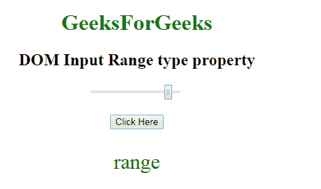

# HTML | DOM 输入范围类型属性

> 原文:[https://www . geesforgeks . org/html-DOM-input-range-type-property/](https://www.geeksforgeeks.org/html-dom-input-range-type-property/)

HTML DOM 中的 **DOM 输入范围类型属性**用于**返回***滑块控件是哪种类型的表单元素*。所有浏览器应返回**“范围”**。而 Internet Explorer 总是返回**“文本”**，而不是**“范围”**。

**语法:**

```html
rangeObject.type 
```

**返回值:**返回一个字符串值，代表滑块控件的表单元素类型。

**示例-1:** 本示例说明如何**返回**输入范围类型属性。

```html
<!DOCTYPE html>
<html>

<head>
    <title>
        HTML DOM Input range type Property
    </title>
</head>
<style>
    #Geek_p {
        font-size: 30px;
        color: green;
    }
</style>

<body style="text-align:center;">

    <h1 style="color:green;"> 
            GeeksForGeeks 
        </h1>

    <h2>DOM Input Range type property </h2>
    <input name=G 
           eek_range type="range" 
           id="Geek_Range"
           value="90">
    <br>
    <br>
    <button onclick="myGeeks()">
        Click Here
    </button>
    <p id="Geek_p">
  </p>
    <script>
        function myGeeks() {

            // Return type.
            var x = 
             document.getElementById(
               "Geek_Range").type;

            document.getElementById(
              "Geek_p").innerHTML = x;
        }
    </script>
</body>

</html>
```

**输出:**
**点击按钮前:**


**点击按钮后:**


**支持的浏览器:****DOM 输入范围类型属性**支持的浏览器如下:

*   谷歌 Chrome
*   微软公司出品的 web 浏览器
*   火狐浏览器
*   歌剧
*   旅行队