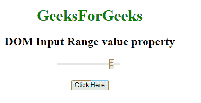
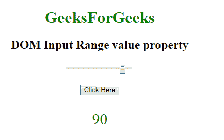
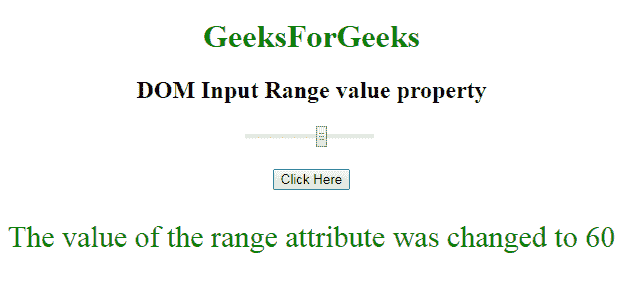

# HTML | DOM 输入范围值属性

> 原文:[https://www . geesforgeks . org/html-DOM-input-range-value-property/](https://www.geeksforgeeks.org/html-dom-input-range-value-property/)

HTML DOM 中的 **DOM 输入范围值属性**用于**设置**或**返回** *滑块控件或输入范围字段*的值。该属性指定默认值或用户类型值。

**语法:**

*   它返回 value 属性。

    ```html
    rangeObject.value
    ```

*   它用于设置 value 属性。

    ```html
    rangeObject.value = number
    ```

**属性值:**它包含一个值，即**数**，指定滑块控件的值。它的默认值是 50。

**返回值:**它返回一个字符串值，该值代表代表滑块控件值的数字。

**示例-1:** 本示例说明了如何**返回**值属性。

```html
<!DOCTYPE html>
<html>

<head>
    <title>
        HTML DOM Input range value Property
    </title>
</head>
<style>
    #Geek_p {
        font-size: 30px;
        color: green;
    }
</style>

<body style="text-align:center;">

    <h1 style="color:green;"> 
            GeeksForGeeks 
        </h1>

    <h2>DOM Input Range value property 
  </h2>
    <input name=G 
           eek_range type="range" 
           id="Geek_Range" 
           value="90">
    <br>
    <br>
    <button onclick="myGeeks()">
        Click Here
    </button>
    <p id="Geek_p"></p>
    <script>
        function myGeeks() {
            var x = 
            document.getElementById(
              "Geek_Range").value;

            document.getElementById(
              "Geek_p").innerHTML = x;
        }
    </script>
</body>

</html>
```

**输出:**
**点击按钮前:**


**点击按钮后:**


**示例-2:** 本示例说明如何**设置**值属性。

```html
<!DOCTYPE html>
<html>

<head>
    <title>
        HTML DOM Input range value Property
    </title>
</head>
<style>
    #Geek_p {
        font-size: 30px;
        color: green;
    }
</style>

<body style="text-align:center;">

    <h1 style="color:green;"> 
            GeeksForGeeks 
        </h1>

    <h2>DOM Input Range value property </h2>
    <input name=G 
           eek_range type="range" 
           id="Geek_Range" 
           value="90">
    <br>
    <br>
    <button onclick="myGeeks()">
        Click Here
    </button>
    <p id="Geek_p"></p>
    <script>
        function myGeeks() {

            // Set range value.
            var x = 
            document.getElementById(
              "Geek_Range").value = 60;

            document.getElementById(
              "Geek_p").innerHTML = 
              "The value of the range attribute was changed to "
            + x;
        }
    </script>
</body>

</html>
```

**输出:**

**点击按钮前:**


**点击按钮后:**


**支持的浏览器:****DOM 输入范围值属性**支持的浏览器如下:

*   谷歌 Chrome
*   微软公司出品的 web 浏览器
*   火狐浏览器
*   歌剧
*   旅行队