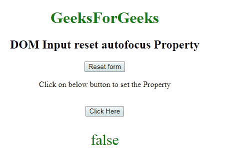

# HTML | DOM 输入重置自动对焦属性

> 原文:[https://www . geesforgeks . org/html-DOM-输入-重置-自动对焦-属性/](https://www.geeksforgeeks.org/html-dom-input-reset-autofocus-property/)

HTML DOM 中的**输入重置自动对焦属性**用于设置或返回页面加载时输入重置字段是否应该对焦。它反映了 HTML 自动对焦属性。

**语法:**

*   它返回自动对焦属性。

    ```html
    resetObject.autofocus
    ```

*   它用于设置自动对焦属性。

    ```html
    resetObject.autofocus = "true|false"
    ```

**属性值:**

*   **true:** 设置复位场的焦点。
*   **假:**有默认值。它定义了重置字段不能获得焦点。

**返回值:**返回一个布尔值，代表复位字段是否自动对焦。

**示例 1:** 本示例返回输入重置自动对焦属性。

```html
<!DOCTYPE html> 
<html> 

<head> 
    <title> 
        HTML DOM Input reset autofocus property 
    </title> 
</head> 

<body style="text-align:center;"> 

    <h1 style="color:green;"> 
        GeeksForGeeks 
    </h1> 

    <h2>DOM Input reset autofocus Property</h2> 

    <form id ="myGeeks">
        <input type="reset" id="GeekReset" name="geeks"
            value="Reset form" autofocus>
    </form>

    <p>
        Click on below button to return the Property
    </p>     

    <button onclick="myGeeks()"> 
        Click Here 
    </button> 

    <p id="Geek_p" style="color:green; font-size:30px;"></p>

    <!-- Script to use Input reset autofocus Property -->
    <script> 
        function myGeeks() { 
            var x = document.getElementById("GeekReset").autofocus;
            document.getElementById("Geek_p").innerHTML = x; 
        } 
    </script> 
</body> 

</html>                    
```

**输出:**
**点击按钮前:**

**点击按钮后:**


**示例 2:** 本示例说明如何设置输入复位自动对焦属性。

```html
<!DOCTYPE html> 
<html> 

<head> 
    <title> 
        HTML DOM Input reset autofocus property 
    </title> 
</head> 

<body style="text-align:center;"> 

    <h1 style="color:green;"> 
        GeeksForGeeks 
    </h1> 

    <h2>
        DOM Input reset autofocus Property
    </h2> 

    <form id ="myGeeks">
        <input type="reset" id="GeekReset" name="geeks"
            value="Reset form" autofocus>
    </form>

    <p>
        Click on below button to set the Property
    </p><br>

    <button onclick="myGeeks()"> 
        Click Here 
    </button> 

    <p id="Geek_p" style="color:green; font-size:30px;"></p>

    <!-- Script to use Input reset autofocus Property -->
    <script> 
        function myGeeks() { 
            var x = document.getElementById("GeekReset").autofocus
                    = false;

            document.getElementById("Geek_p").innerHTML = x; 
        } 
    </script> 
</body> 

</html>                    
```

**输出:**
**点击按钮前:**

**点击按钮后:**


**支持的浏览器:**T2 DOM 输入重置自动对焦属性支持的浏览器如下:

*   谷歌 Chrome
*   微软公司出品的 web 浏览器
*   火狐浏览器
*   歌剧
*   旅行队