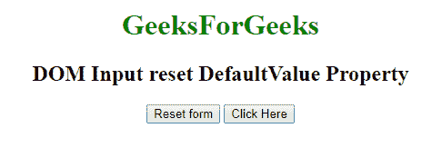
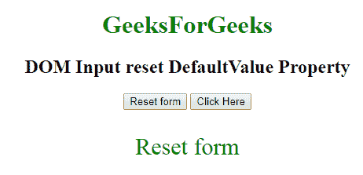
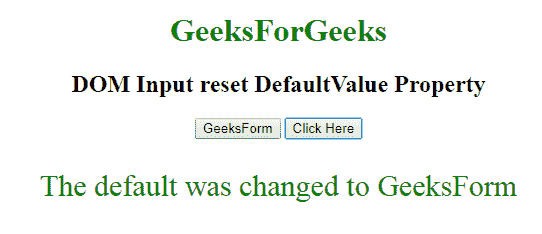

# HTML | DOM 输入重置默认值属性

> 原文:[https://www . geesforgeks . org/html-DOM-input-reset-default value-property/](https://www.geeksforgeeks.org/html-dom-input-reset-defaultvalue-property/)

HTML DOM 中的**输入复位默认值属性**用于设置或返回复位字段的默认值。此属性用于反映 HTML 值属性。默认值与值的主要区别在于，默认值表示默认值，值包含进行一些更改后的当前值。此属性对于确定日期字段是否已更改非常有用。
**语法:**

*   它返回 defaultValue 属性。

```html
resetObject.defaultValue
```

*   它用于设置 defaultValue 属性。

```html
resetObject.defaultValue = value
```

**属性值:**包含单个属性值**值**，定义输入复位字段的默认值。
**返回值:**返回一个代表输入复位字段默认值的字符串值。
**示例 1:** 本示例说明如何返回输入重置默认值属性。

## 超文本标记语言

```html
<!DOCTYPE html>
<html>

<head>
    <title>
        HTML DOM Input reset defaultValue property
    </title>
</head>

<body style="text-align:center;">

    <h1 style="color:green;">
        GeeksForGeeks
    </h1>

    <h2>DOM Input reset DefaultValue Property</h2>

    <input type="reset" id="GeekReset" value="Reset form">

    <button onclick="myGeeks()">
        Click Here
    </button>

    <p id="Geek_p" style="font-size:30px; color:green;"></p>

    <!-- Script to use Input reset value Property -->
    <script>
        function myGeeks() {
            var x =
            document.getElementById("GeekReset").defaultValue;

            document.getElementById("Geek_p").innerHTML = x;
        }
    </script>
</body>

</html>
```

**输出:**

*   **点击按钮前:**



*   **点击按钮后:**



**示例 2:** 本示例说明如何设置输入重置默认值属性。

## 超文本标记语言

```html
<!DOCTYPE html>
<html>

<head>
    <title>
        HTML DOM Input reset defaultvalue property
    </title>
</head>

<body style="text-align:center;">

    <h1 style="color:green;">
        GeeksForGeeks
    </h1>

    <h2>DOM Input reset DefaultValue Property</h2>

    <input type="reset" id="GeekReset" value="Reset form">

    <button onclick="myGeeks()">
        Click Here
    </button>

    <p id="Geek_p" style="font-size:30px; color:green;"></p>

    <!-- Script to use Input reset defaultvalue Property -->
    <script>
        function myGeeks() {
            var x = document.getElementById("GeekReset").defaultValue
                     = "GeeksForm";

            document.getElementById("Geek_p").innerHTML
                     = "The default was changed to " + x;
        }
    </script>
</body>

</html>
```

**输出:**

*   **点击按钮前:**


*   **点击按钮后:**



**支持的浏览器:**T2 DOM Input 重置默认值属性支持的浏览器如下:

*   谷歌 Chrome
*   微软公司出品的 web 浏览器
*   火狐浏览器
*   苹果 Safari
*   歌剧