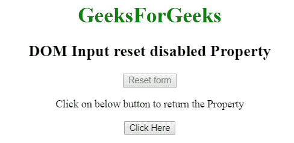
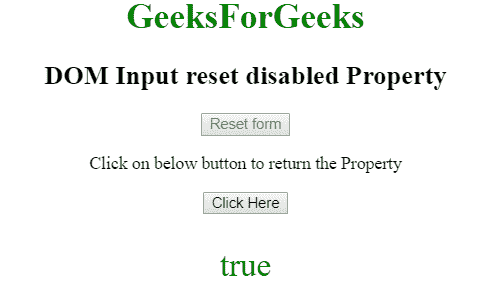
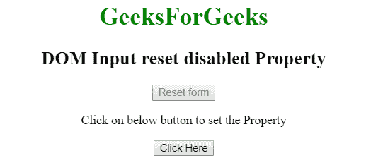
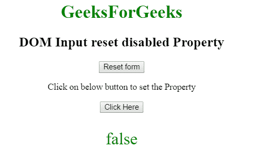

# HTML | DOM 输入重置禁用属性

> 原文:[https://www . geesforgeks . org/html-DOM-输入-重置-禁用-属性/](https://www.geeksforgeeks.org/html-dom-input-reset-disabled-property/)

HTML DOM 中的**输入重置禁用属性**用于设置或返回一个布尔值，该值表示重置按钮字段是否应被禁用。默认情况下，禁用的元素以灰色显示，不可用且不可拾取。

**语法:**

*   它返回禁用的属性。

    ```html
    resetObject.disabled
    ```

*   它用于设置禁用属性。

    ```html
    resetObject.disabled = true|false
    ```

**属性值:**

*   **真:**表示复位按钮被禁用。
*   **false:** 表示未禁用复位按钮。

**默认值:**假

**返回值:**返回布尔值，即如果重置按钮字段被禁用，则为真；如果重置字段未被禁用，则为假。

**示例 1:** 本示例返回禁用属性的值。

```html
<!DOCTYPE html> 
<html> 

<head> 
    <title> 
        HTML DOM Input reset disabled property 
    </title> 
</head> 

<body style="text-align:center;"> 

    <h1 style="color:green;"> 
        GeeksForGeeks 
    </h1> 

    <h2>DOM Input reset disabled Property</h2> 

    <input type="reset" id="GeekReset" name="geeks"
            value="Reset form" disabled> 

    <p>
        Click on below button to return the Property
    </p>     

    <button onclick="myGeeks()"> 
        Click Here 
    </button> 

    <p id="Geek_p" style="font-size:30px; color:green;"></p> 

    <script> 
        function myGeeks() { 

            // Access input element with type = "reset" 
            var x = document.getElementById("GeekReset").disabled; 
            document.getElementById("Geek_p").innerHTML = x; 
        } 
    </script> 
</body> 

</html>                    
```

**输出:**
**点击按钮前:**

**点击按钮后:**


**示例 2:** 本示例说明如何设置输入复位禁用属性。

```html
<!DOCTYPE html> 
<html> 

<head> 
    <title> 
        HTML DOM Input reset disabled property 
    </title> 
</head> 

<body style="text-align:center;"> 

    <h1 style="color:green;"> 
        GeeksForGeeks 
    </h1> 

    <h2>DOM Input reset disabled Property</h2> 

    <input type="reset" id="GeekReset" name="geeks"
            value="Reset form" disabled> 

    <p>
        Click on below button to set the Property
    </p>     

    <button onclick="myGeeks()"> 
        Click Here 
    </button> 

    <p id="Geek_p" style="font-size:30px; color:green;"></p> 

    <!-- Script to use Input Reset disabled property -->
    <script> 
        function myGeeks() { 

            var x = document.getElementById("GeekReset").disabled
                    = false; 

            document.getElementById("Geek_p").innerHTML = x; 
        } 
    </script> 
</body> 

</html>                    
```

**输出:**
**点击按钮前:**

**点击按钮后:**


**支持的浏览器:****DOM 输入重置禁用属性**支持的浏览器如下:

*   谷歌 Chrome
*   微软公司出品的 web 浏览器
*   火狐浏览器
*   歌剧
*   旅行队