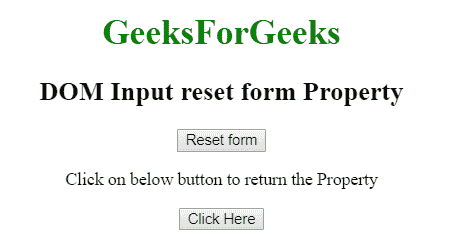
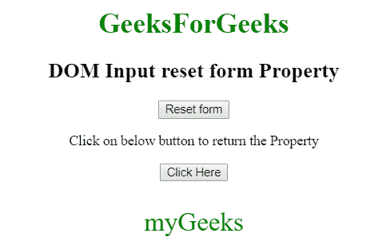

# HTML | DOM 输入重置表单属性

> 原文:[https://www . geesforgeks . org/html-DOM-input-reset-form-property/](https://www.geeksforgeeks.org/html-dom-input-reset-form-property/)

HTML DOM 中的**输入重置表单属性**用于返回包含输入重置按钮字段的表单的引用。它是只读属性。
**语法:**

```html
resetObject.form 
```

**返回值**:返回一个字符串值，指定包含输入重置字段的表单的引用

以下示例说明了输入重置表单属性。
**示例:**本示例返回输入重置表单属性。

## 超文本标记语言

```html
<!DOCTYPE html>
<html>

<head>
    <title>
        HTML DOM Input reset form property
    </title>
</head>

<body style="text-align:center;">

    <h1 style="color:green;">
        GeeksForGeeks
    </h1>

    <h2>DOM Input reset form Property</h2>

    <form id ="myGeeks">
        <input type="reset" id="GeekReset" name="geeks"
                value="Reset form" >
    </form>

<p>
        Click on below button to return the Property
    </p>

    <button onclick="myGeeks()">
        Click Here
    </button>

    <p id="Geek_p" style="color:green; font-size:30px;"></p>

    <!-- Script to use Input Reset form Property -->
    <script>
        function myGeeks() {
            var x = document.getElementById("GeekReset").form.id;
            document.getElementById("Geek_p").innerHTML = x;
        }
    </script>
</body>

</html>                   
```

**输出:**
**点击按钮前:**



**点击按钮后:**



**支持的浏览器:**T2 DOM 输入重置表单属性支持的浏览器如下:

*   谷歌 Chrome
*   微软公司出品的 web 浏览器
*   火狐浏览器
*   歌剧
*   旅行队