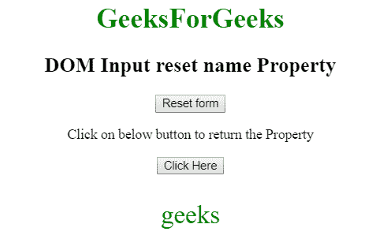

# HTML | DOM 输入重置名称属性

> 原文:[https://www . geesforgeks . org/html-DOM-input-reset-name-property/](https://www.geeksforgeeks.org/html-dom-input-reset-name-property/)

HTML DOM 中的**输入重置名称属性**用于设置或返回重置字段的名称属性值。每个输入字段都需要名称属性。如果没有在输入字段中指定 name 属性，则根本不会发送该字段的数据。

**语法:**

*   它返回输入重置名称属性。

    ```html
    resetObject.name
    ```

*   它用于设置输入重置名称属性。

    ```html
    resetObject.name = name
    ```

**属性值:**它包含单个值**名称**，该名称定义了重置按钮字段的名称。

**返回值:**返回代表复位按钮字段名称的字符串值。

**示例 1:** 本示例说明如何返回 Input 重置名称属性。

```html
<!DOCTYPE html> 
<html> 

<head> 
    <title> 
        HTML DOM Input reset name property 
    </title> 
</head> 

<body style="text-align:center;"> 

    <h1 style="color:green;"> 
        GeeksForGeeks 
    </h1> 

    <h2>DOM Input reset name Property</h2> 

    <input type="reset" id="GeekReset" name="geeks"
            value="Reset form"> 

    <p>
        Click on below button to return the Property
    </p>     

    <button onclick="myGeeks()"> 
        Click Here 
    </button> 

    <p id="Geek_p" style="font-size:30px; color:green;"></p> 

    <script> 
        function myGeeks() { 
            // access input element with type = "reset" 
            var x = 
            document.getElementById("GeekReset").name; 
            document.getElementById("Geek_p").innerHTML = 
            x; 
        } 
    </script> 
</body> 

</html>                    
```

**输出:**
**点击按钮前:**

**点击按钮后:**


**示例 2:** 本示例说明如何设置输入重置名称属性。

```html
<!DOCTYPE html> 
<html> 

<head> 
    <title> 
        HTML DOM Input reset name property 
    </title> 
</head> 

<body style="text-align:center;"> 

    <h1 style="color:green;"> 
        GeeksForGeeks 
    </h1> 

    <h2>DOM Input reset name Property</h2> 

    <input type="reset" id="GeekReset" name="geeks"
            value="Reset form"> 

    <p>
        Click on below button to set the Property
    </p>     

    <button onclick="myGeeks()"> 
        Click Here 
    </button> 

    <p id="Geek_p" style="font-size:30px; color:green;"></p> 

    <script> 
        function myGeeks() { 
            // access input element with type = "reset" 
            var x = 
            document.getElementById("GeekReset").name
                    = "myGeeks"; 

            document.getElementById("Geek_p").innerHTML
                    = "The value of the name attribute was"
                      + " changed to " + 
            x; 
        } 
    </script> 
</body> 

</html>                    
```

**输出:**
**点击按钮前:**

**点击按钮后:**


**支持的浏览器:****DOM 输入重置名称属性**支持的浏览器如下:

*   谷歌 Chrome
*   Internet Explorer 10.0
*   火狐浏览器
*   歌剧
*   旅行队