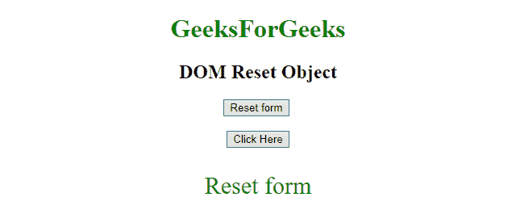
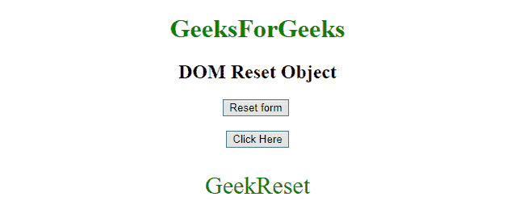

# HTML | DOM 输入重置对象

> 原文:[https://www.geeksforgeeks.org/html-dom-input-reset-object/](https://www.geeksforgeeks.org/html-dom-input-reset-object/)

HTML DOM 中的**输入重置对象**用来表示 HTML [<用 ***类型=【重置】*** 输入>](https://www.geeksforgeeks.org/html5-date-attribute-in-input-tag/) 元素。
该标签用于**访问**或**创建****<输入>** 元素。可以使用 **getElementById()** 方法访问该元素。

**语法:**

```html
document.getElementById("Input_ID");

```

该输入标识被分配给 HTML <input>元素。

**示例-1:** 创建<用 ***输入>元素。***

```html
<!DOCTYPE html>
<html>

<head>
    <title>
        HTML DOM RESET Object
    </title>
</head>

<body style="text-align:center;">

    <h1 style="color:green;">  
            GeeksForGeeks  
        </h1>

    <h2>DOM Reset Object</h2>

    <button onclick="myGeeks()">
        Click Here
    </button>

    <script>
        function myGeeks() {
            // creating input element with type = "reset"
            var x = document.createElement("INPUT");
            x.setAttribute("type", "reset");
            document.body.appendChild(x);
        }
    </script>
</body>

</html>
```

**输出:**

*   **之前点击按钮:**
    
*   **点击按钮后:**
    

**示例-2:** 使用**文档从**【极客重置】** id 输入>元素的返回值**

```html
<!DOCTYPE html>
<html>

<head>
    <title>
        HTML DOM RESET Object
    </title>
</head>
<style>
    #Geek_p {
        font-size: 30px;
        color: green;
    }
</style>

<body style="text-align:center;">

    <h1 style="color:green;">  
            GeeksForGeeks  
        </h1>

    <h2>DOM Reset Object</h2>
    <input type="reset" 
           id="GeekReset" 
           value="Reset form">
    <br>
    <br>
    <button onclick="myGeeks()">
        Click Here
    </button>
    <p id="Geek_p"></p>
    <script>
        function myGeeks() {
            // access input element with type = "reset"
            var x = 
             document.getElementById("GeekReset").value;
            document.getElementById("Geek_p").innerHTML = 
            x;
        }
    </script>
</body>

</html>
```

**输出:**

*   **之前点击按钮:**
    
*   **After click on the button:**
    

    **示例-3:** 用 type="reset "返回输入元素的 id。

    ```html
    <!DOCTYPE html>
    <html>

    <head>
        <title>
            HTML DOM RESET Object
        </title>
    </head>
    <style>
        #Geek_p {
            font-size: 30px;
            color: green;
        }
    </style>

    <body style="text-align:center;">

        <h1 style="color:green;">  
                GeeksForGeeks  
            </h1>

        <h2>DOM Reset Object</h2>
        <input type="reset" 
               id="GeekReset"
               value="Reset form">
        <br>
        <br>
        <button onclick="myGeeks()">
            Click Here
        </button>
        <p id="Geek_p"></p>
        <script>
            function myGeeks() {
                // access input element with type = "reset" 
                var x =
                document.getElementById("GeekReset").id;
                document.getElementById("Geek_p").innerHTML =
                  x;
            }
        </script>
    </body>

    </html>
    ```

    **输出:**

    *   **之前点击按钮:**
        
    *   **点击按钮后:**
        

    **注意:** *type="reset"* 用于使用**【重置按钮】**将所有值重置为其初始值。

    **支持的浏览器:**

    *   谷歌 Chrome
    *   Mozilla Firefox
    *   边缘
    *   旅行队
    *   歌剧