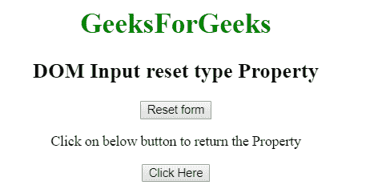
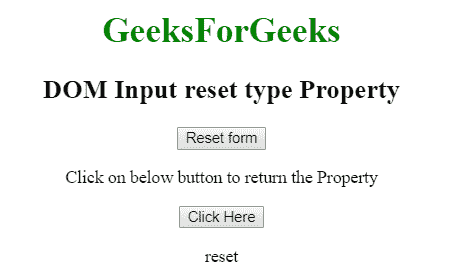

# HTML | DOM 输入重置类型属性

> 原文:[https://www . geesforgeks . org/html-DOM-input-reset-type-property/](https://www.geeksforgeeks.org/html-dom-input-reset-type-property/)

HTML DOM 中的**输入重置类型属性**用于返回重置字段的表单元素类型。它总是返回输入重置字段的文本。
**语法:**

```html
resetObject.type
```

下面的程序说明了 HTML DOM 中的重置类型属性:
R **返回值:**它返回一个字符串值，代表输入重置字段的表单元素类型。

**示例:**本示例返回重置字段的表单元素类型。

## 超文本标记语言

```html
<!DOCTYPE html>
<html>

<head>
    <title>
        HTML DOM Input reset type property
    </title>
</head>

<body style="text-align:center;">

    <h1 style="color:green;">
        GeeksForGeeks
    </h1>

    <h2>DOM Input reset type Property</h2>

    <input type="reset" id="GeekReset" value="Reset form">

<p>
        Click on below button to return the Property
    </p>

    <button onclick="myGeeks()">
        Click Here
    </button>

    <p id="Geek_p"></p>

    <script>
        function myGeeks() {

            // access input element with type = "reset"
            var x =
            document.getElementById("GeekReset").type;
            document.getElementById("Geek_p").innerHTML = x;
        }
    </script>
</body>

</html>                   
```

**输出:**
**点击按钮前:**



**点击按钮后:**



**支持的浏览器:**T2 DOM 输入重置类型属性支持的浏览器如下:

*   谷歌 Chrome
*   微软公司出品的 web 浏览器
*   火狐浏览器
*   歌剧
*   旅行队