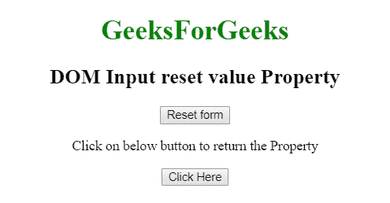
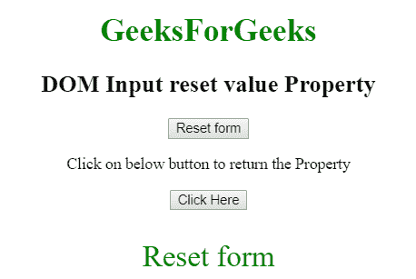
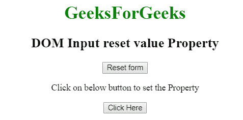
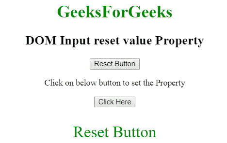

# HTML | DOM 输入重置值属性

> 原文:[https://www . geesforgeks . org/html-DOM-input-reset-value-property/](https://www.geeksforgeeks.org/html-dom-input-reset-value-property/)

HTML DOM 中的**输入重置值属性**用于设置或返回输入重置字段的值属性的值。值属性指定重置字段中显示的文本。

**语法:**

*   它返回输入重置值属性。

    ```html
    resetObject.value
    ```

*   It is used to set the Input Reset value Property.

    ```html
    resetObject.value = text
    ```

    **属性值:**包含单值**文本**，定义复位按钮中显示的文本。

    **返回值:**返回代表复位按钮中显示的文本的字符串值。

    **示例 1:** 本示例说明如何返回输入重置值属性。

    ```html
    <!DOCTYPE html> 
    <html> 

    <head> 
        <title> 
            HTML DOM Input reset value property 
        </title> 
    </head> 

    <body style="text-align:center;"> 

        <h1 style="color:green;"> 
            GeeksForGeeks 
        </h1> 

        <h2>DOM Input reset value Property</h2> 

        <input type="reset" id="GeekReset" value="Reset form"> 

        <p>
            Click on below button to return the Property
        </p>     

        <button onclick="myGeeks()"> 
            Click Here 
        </button> 

        <p id="Geek_p" style="font-size:30px; color:green;"></p> 

        <!-- Script to use Input reset value Property -->
        <script> 
            function myGeeks() { 
                var x = document.getElementById("GeekReset").value; 
                document.getElementById("Geek_p").innerHTML = x; 
            } 
        </script> 
    </body> 

    </html>                    
    ```

    **输出:**
    **点击按钮前:**
    
    **点击按钮后:**
    

    **示例 2:** 本示例说明如何设置输入复位值属性。

    ```html
    <!DOCTYPE html> 
    <html> 

    <head> 
        <title> 
            HTML DOM Input reset value property 
        </title> 
    </head> 

    <body style="text-align:center;"> 

        <h1 style="color:green;"> 
            GeeksForGeeks 
        </h1> 

        <h2>DOM Input reset value Property</h2> 

        <input type="reset" id="GeekReset" value="Reset form"> 

        <p>
            Click on below button to set the Property
        </p>     

        <button onclick="myGeeks()"> 
            Click Here 
        </button> 

        <p id="Geek_p" style="font-size:30px; color:green;"></p> 

        <!-- Script to use Input reset value Property -->
        <script> 
            function myGeeks() { 
                var x = document.getElementById("GeekReset").value
                        = "Reset Button"; 

                document.getElementById("Geek_p").innerHTML = x; 
            } 
        </script> 
    </body> 

    </html>                    
    ```

    **输出:**
    **点击按钮前:**
    
    **点击按钮后:**
    

    **支持的浏览器:****DOM 输入重置值属性**支持的浏览器如下:

    *   谷歌 Chrome
    *   微软公司出品的 web 浏览器
    *   火狐浏览器
    *   歌剧
    *   旅行队