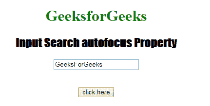
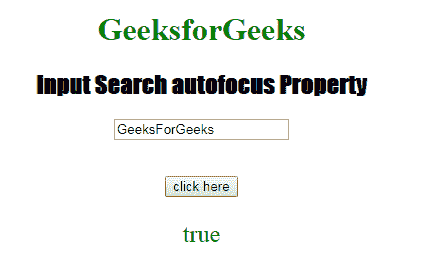
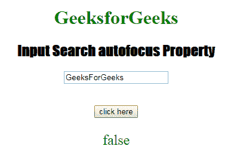

# HTML | DOM 输入搜索自动对焦属性

> 原文:[https://www . geesforgeks . org/html-DOM-input-search-autofocus-property/](https://www.geeksforgeeks.org/html-dom-input-search-autofocus-property/)

HTML DOM 中的 **DOM 输入搜索自动聚焦属性**用于**设置**或**返回**页面加载时输入搜索字段是否应获得焦点。它反映了 HTML 自动对焦属性。

**语法:**

*   它返回自动对焦属性。

    ```html
    searchObject.autofocus
    ```

*   它用于设置自动对焦属性。

    ```html
    searchObject.autofocus = "true|false"
    ```

**属性值:**

*   **true:** 设置搜索字段的焦点。
*   **假:**有默认值。它定义了搜索字段不能获得焦点。

**返回值:**返回一个布尔值，代表搜索字段是否自动对焦。

**示例-1:** 本示例返回输入搜索自动对焦属性。

```html
<!DOCTYPE html>
<html>

<head>
    <title>
      Input Search autofocus Property
  </title>
    <style>
        h1 {
            color: green;
        }

        h2 {
            font-family: Impact;
        }

        body {
            text-align: center;
        }
    </style>
</head>

<body>

    <h1>GeeksforGeeks</h1>
    <h2>Input Search autofocus Property</h2>
    <form id="myGeeks">
        <input type="Search" 
               id="test" 
               name="myGeeks"
               placeholder="Type to search.." 
               value="GeeksForGeeks"
               autofocus>
    </form>
    <br>
    <br>
    <button ondblclick="Access()">click here
    </button>

    <p id="check"
       style="font-size:24px;
              color:green;">
  </p>

    <script>
        function Access() {

            // type="search" 
            var s = document.getElementById(
                "test").autofocus;

            document.getElementById(
                "check").innerHTML = s;
        }
    </script>

</body>

</html>
```

**输出:**
**点击按钮前:**


**点击按钮后:**


**示例-2:** 这个示例说明了如何**设置**属性。

```html
<!DOCTYPE html>
<html>

<head>
    <title>
      Input Search autofocus Property
  </title>
    <style>
        h1 {
            color: green;
        }

        h2 {
            font-family: Impact;
        }

        body {
            text-align: center;
        }
    </style>
</head>

<body>

    <h1>GeeksforGeeks</h1>
    <h2>Input Search autofocus Property</h2>
    <form id="myGeeks">
        <input type="Search"
               id="test"
               name="myGeeks"
               placeholder="Type to search.." 
               value="GeeksForGeeks"
               autofocus>
    </form>
    <br>
    <br>
    <button ondblclick="Access()">click here
    </button>

    <p id="check"
       style="font-size:24px;
              color:green;">
  </p>

    <script>
        function Access() {

            // type="search" 
            var s = document.getElementById(
                "test").autofocus = false;

            document.getElementById(
                "check").innerHTML = s;
        }
    </script>

</body>

</html>
```

**输出:**
**点击按钮前:**


**点击按钮后:**


**支持的浏览器:**T2 DOM 输入搜索自动对焦属性支持的浏览器如下:

*   谷歌 Chrome
*   Internet Explorer 10.0 +
*   火狐浏览器
*   歌剧
*   旅行队