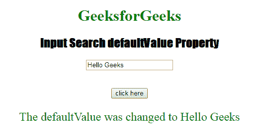

# HTML | DOM 输入搜索默认值属性

> 原文:[https://www . geesforgeks . org/html-DOM-input-search-default value-property/](https://www.geeksforgeeks.org/html-dom-input-search-defaultvalue-property/)

HTML DOM 中的 **DOM 输入搜索默认值属性**用于**设置**或**返回** *搜索字段的默认值*。此属性用于反映 HTML 值属性。*默认值*与*值*的主要区别在于，默认值表示默认值，该值包含一些更改后的当前值。该属性有助于了解搜索字段是否已更改。

**语法:**

*   它返回 defaultValue 属性。

    ```html
    searchObject.defaultValue
    ```

*   它用于设置 defaultValue 属性。

    ```html
    searchObject.defaultValue = value
    ```

**属性值:**它包含一个定义搜索字段默认值的属性值。

**返回值:**返回一个字符串值，代表搜索字段的默认值。

**示例-1:** 本示例说明如何返回 Input 搜索 defaultValue 属性。

```html
<!DOCTYPE html>
<html>

<head>
    <title>
      Input Search defaultValue Property
  </title>
    <style>
        h1 {
            color: green;
        }

        h2 {
            font-family: Impact;
        }

        body {
            text-align: center;
        }
    </style>
</head>

<body>

    <h1>GeeksforGeeks</h1>
    <h2>Input Search defaultValue Property</h2>
    <form id="myGeeks">
        <input type="Search" 
               id="test"
               name="myGeeks" 
               placeholder="Type to search.."
               value="GeeksForGeeks">
    </form>
    <br>
    <br>
    <button ondblclick="Access()">
      click here
    </button>

    <p id="check" 
       style="font-size:24px;color:green;">
  </p>

    <script>
        function Access() {

            // type="search" 
            var s = document.getElementById(
                "test").defaultValue;

            document.getElementById(
                "check").innerHTML = s;
        }
    </script>

</body>

</html>
```

**输出:**
**点击按钮前:**


**点击按钮后:**


**示例-2:** 本示例说明如何设置属性。

```html
<!DOCTYPE html>
<html>

<head>
    <title>
      Input Search defaultValue Property
  </title>
    <style>
        h1 {
            color: green;
        }

        h2 {
            font-family: Impact;
        }

        body {
            text-align: center;
        }
    </style>
</head>

<body>

    <h1>GeeksforGeeks</h1>
    <h2>Input Search defaultValue Property</h2>
    <form id="myGeeks">
        <input type="Search"
               id="test"
               name="myGeeks"
               placeholder="Type to search.." 
               value="GeeksForGeeks">
    </form>
    <br>
    <br>
    <button ondblclick="Access()">
      click here
    </button>

    <p id="check" 
       style="font-size:24px;
              color:green;">
  </p>

    <script>
        function Access() {

            // type="search" 
            var s = document.getElementById(
                "test").defaultValue = "Hello Geeks";

            document.getElementById(
                "check").innerHTML = 
              "The defaultValue was changed to " + s; 
        }
    </script>

</body>

</html>
```

**输出:**

**点击按钮前:**


**点击按钮后:**


**支持的浏览器:**T2 DOM 输入搜索缺省值属性支持的浏览器如下:

*   谷歌 Chrome
*   Internet Explorer 10.0 +
*   火狐浏览器
*   歌剧
*   旅行队