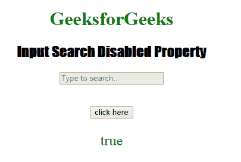
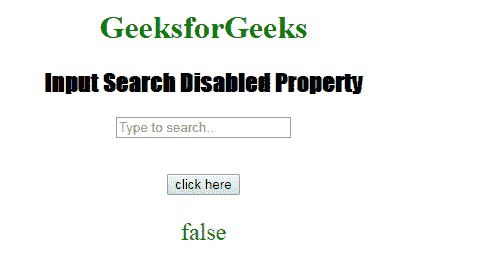

# HTML | DOM 输入搜索禁用属性

> 原文:[https://www . geesforgeks . org/html-DOM-input-search-disabled-property/](https://www.geeksforgeeks.org/html-dom-input-search-disabled-property/)

HTML DOM 中的 **DOM 输入搜索禁用属性**用于**返回**一个布尔值，该值表示搜索字段是否应被禁用。
默认情况下，禁用的元素以灰色显示，不可用且不可点击。

**语法:**

*   它返回禁用的属性。

    ```html
    searchObject.disabled
    ```

*   它用于设置禁用属性。

    ```html
    searchObject.disabled = true
    ```

**属性值:**

*   **true:** 指定搜索字段被禁用。
*   **false:** 有默认值。它指定不禁用搜索字段。

**返回值:**返回布尔值，即如果搜索字段被禁用则为真，如果搜索字段未被禁用则为假。

**示例-1:** 本示例返回禁用属性的值。

```html
<!DOCTYPE html>
<html>

<head>
    <title>
      Input Search disabled Property
  </title>
    <style>
        h1 {
            color: green;
        }

        h2 {
            font-family: Impact;
        }

        body {
            text-align: center;
        }
    </style>
</head>

<body>

    <h1>GeeksforGeeks</h1>
    <h2>Input Search Disabled Property</h2>
    <form id="myGeeks">
        <input type="Search" 
               id="test" 
               name="myGeeks"
               placeholder="Type to search.." 
               disabled>
    </form>
    <br>
    <br>
    <button ondblclick="Access()">
      click here
    </button>

    <p id="check"
       style="font-size:24px;
              color:green;">
  </p>

    <script>
        function Access() {

            // type="search" 
            var s = document.getElementById(
                "test").disabled;

            document.getElementById(
                "check").innerHTML = s;
        }
    </script>

</body>

</html>
```

**输出:**
**点击按钮前:**


**点击按钮后:**


**示例-2:** 本示例说明如何设置属性。

```html
<!DOCTYPE html>
<html>

<head>
    <title>Input Search disabled Property</title>
    <style>
        h1 {
            color: green;
        }

        h2 {
            font-family: Impact;
        }

        body {
            text-align: center;
        }
    </style>
</head>

<body>

    <h1>GeeksforGeeks</h1>
    <h2>Input Search Disabled Property</h2>
    <form id="myGeeks">
        <input type="Search"
               id="test"
               name="myGeeks" 
               placeholder="Type to search.."
               disabled>
    </form>
    <br>
    <br>
    <button ondblclick="Access()">
      click here
    </button>

    <p id="check" 
       style="font-size:24px;
              color:green;">
  </p>

    <script>
        function Access() {

            // type="search" 
            var s = document.getElementById(
                "test").disabled = false;

            document.getElementById(
                "check").innerHTML = s;
        }
    </script>

</body>

</html>
```

**输出:**
**点击按钮前:**


**点击按钮后:**


**支持的浏览器:**支持的浏览器 **DOM 输入搜索禁用属性**如下:

*   谷歌 Chrome
*   Internet Explorer 10.0 +
*   火狐浏览器
*   歌剧
*   旅行队