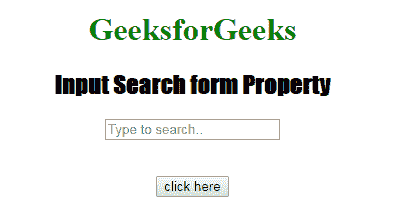
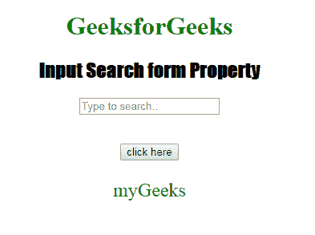

# HTML | DOM 输入搜索表单属性

> 原文:[https://www . geesforgeks . org/html-DOM-input-search-form-property/](https://www.geeksforgeeks.org/html-dom-input-search-form-property/)

HTML DOM 中的 **DOM 输入搜索表单属性**用于返回包含输入搜索字段的表单的引用。成功时返回表单对象的是只读属性。
**语法:**

```html
searchObject.form 
```

**返回值:**它返回一个字符串值，该值指定包含输入搜索字段的表单的引用

**示例:**下面说明输入搜索表单属性的程序。

## 超文本标记语言

```html
<!DOCTYPE html>
<html>

<head>
    <title>
      Input Search form Property
  </title>
    <style>
        h1 {
            color: green;
        }

        h2 {
            font-family: Impact;
        }

        body {
            text-align: center;
        }
    </style>
</head>

<body>

    <h1>GeeksforGeeks</h1>
    <h2>Input Search form Property</h2>
    <form id="myGeeks">
        <input type="Search"
               id="test"
               name="myGeeks"
               placeholder="Type to search..">
    </form>
    <br>
    <br>
    <button ondblclick="Access()">
      click here
    </button>

    <p id="check"
       style="font-size:24px;
              color:green;">
  </p>

    <script>
        function Access() {

            // type="search"
            var s = document.getElementById(
                "test").form.id;

            document.getElementById(
                "check").innerHTML = s;
        }
    </script>

</body>

</html>
```

**输出:**
**点击按钮前:**



**点击按钮后:**



**支持的浏览器:**T2 DOM 输入搜索表单属性支持的浏览器如下:

*   谷歌 Chrome
*   微软公司出品的 web 浏览器
*   火狐浏览器
*   歌剧
*   旅行队