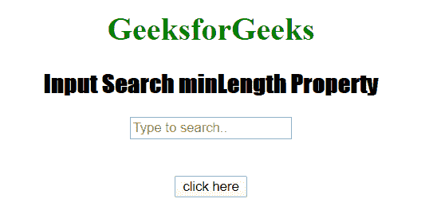

# HTML | DOM 输入搜索最小长度属性

> 原文:[https://www . geesforgeks . org/html-DOM-input-search-min length-property/](https://www.geeksforgeeks.org/html-dom-input-search-minlength-property/)

HTML DOM 中的**输入搜索最小长度属性**用于**设置**或**返回**搜索输入字段的最小长度属性值。它指定搜索字段中允许的最小字符数。

**语法:**

*   它返回输入搜索长度属性。

    ```html
    searchObject.minLength
    ```

*   它用于设置输入搜索最小长度属性。

    ```html
    searchObject.minLength = number
    ```

**属性值:**它包含单个数值，用于指定搜索最小长度字段中允许的最小字符数。

**返回值:**它返回一个数值，代表搜索最小长度字段中允许的最小字符数。

**示例 1:** 本示例说明如何返回 Input 搜索 minLength 属性。

```html
<!DOCTYPE html>
<html>

<head>
    <title>
        Input Search minLength Property
    </title>

    <style>
        h1 {
            color: green;
        }

        h2 {
            font-family: Impact;
        }

        body {
            text-align: center;
        }
    </style>
</head>

<body>

    <h1>GeeksforGeeks</h1>
    <h2>Input Search minLength Property</h2>

    <form id="myGeeks">
        <input type="Search" id="test" name="myGeeks"
            placeholder="Type to search.." minlength="45">
    </form>
    <br><br>

    <button ondblclick="Access()">
        click here
    </button>

    <p id="check" style="font-size:24px; 
            color:green;">
    </p>

    <script>
        function Access() {

            // type="search" 
            var s = document.getElementById(
                "test").minLength;

            document.getElementById(
                "check").innerHTML = s;
        } 
    </script>
</body>

</html> 
```

**输出:**

*   **点击按钮前:**
    
*   **点击按钮后:**
    

**示例 2:** 本示例说明如何设置 Input 搜索 minLength 属性。

```html
<!DOCTYPE html>
<html>

<head>
    <title>
        Input Search minLength Property
    </title>

    <style>
        h1 {
            color: green;
        }

        h2 {
            font-family: Impact;
        }

        body {
            text-align: center;
        }
    </style>
</head>

<body>

    <h1>GeeksforGeeks</h1>
    <h2>Input Search minLength Property</h2>
    <form id="myGeeks">
        <input type="Search" id="test" name="myGeeks" 
            placeholder="Type to search.." minlength="45">
    </form>
    <br><br>

    <button ondblclick="Access()">
        click here
    </button>

    <p id="check" style="font-size:24px; 
            color:green;">
    </p>

    <script>
        function Access() {

            // type="search" 
            var s = document.getElementById(
                "test").minLength = "23";

            document.getElementById(
                "check").innerHTML = s;
        } 
    </script>
</body>

</html>
```

**输出:**

*   **点击按钮前:**
    
*   **点击按钮后:**
    

**支持的浏览器:**T2 DOM 输入搜索最小长度属性支持的浏览器如下:

*   谷歌 Chrome
*   微软公司出品的 web 浏览器
*   火狐浏览器
*   歌剧
*   旅行队