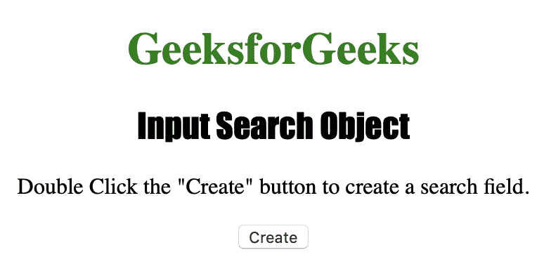
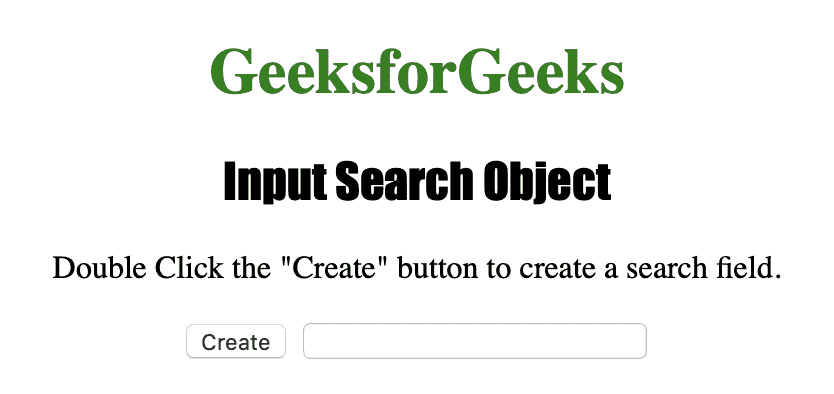
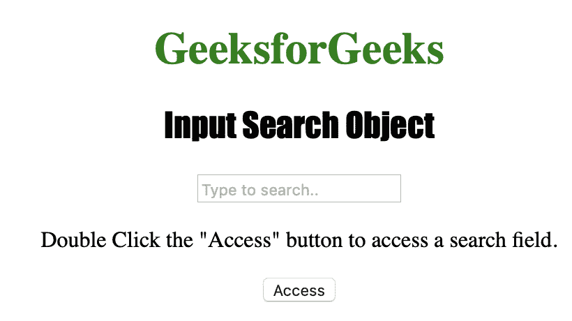
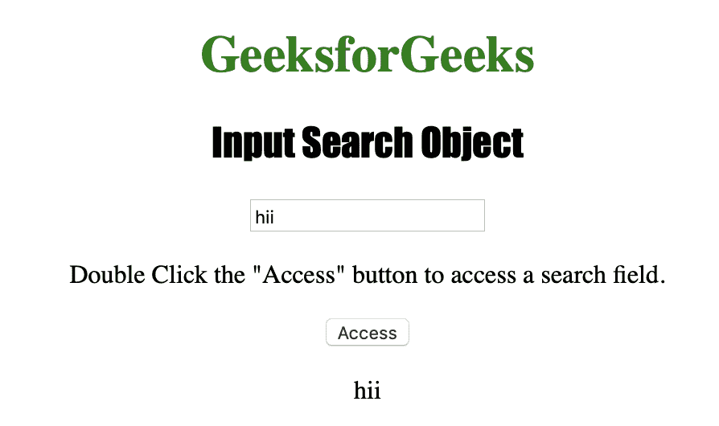

# HTML | DOM 输入搜索对象

> 原文:[https://www.geeksforgeeks.org/html-dom-input-search-object/](https://www.geeksforgeeks.org/html-dom-input-search-object/)

**输入搜索对象**用于表示**类型的【搜索】**元素的 HTML strong <输入。
输入搜索对象是 HTML5 中的新对象。

**语法:**

*   要创建一个 **<输入>** 元素
*   **用于访问<的语法使用 type ="search":**

    ```html
    var s = document.getElementById("search_object");
    ```

    输入>元素

**属性值:**

| 价值 | 描述 |
| 自动完成 | 它用于设置或返回搜索字段的自动完成属性的值。 |
| 自（动）调焦装置 | 它用于设置或返回页面加载时搜索字段是否应自动获得焦点。 |
| 缺省值 | 它用于设置或返回搜索字段的默认值。 |
| 有缺陷的 | 它用于设置或返回搜索字段是否被禁用。 |
| 形式 | 它用于返回对包含搜索字段的表单的引用。 |
| 目录 | 它用于返回对包含搜索字段的数据列表的引用。 |
| 最大 | 它用于设置或返回搜索字段的 max 属性值。 |
| 部 | 设置或返回搜索字段的 min 属性值。 |
| 名字 | 它用于设置或返回搜索字段的名称属性值。 |
| 只读的 | 它用于设置或返回搜索字段是否为只读。 |
| 需要 | 用于设置或返回提交表单前是否必须填写搜索字段。 |
| 步骤 | 它用于设置或返回搜索字段的步骤属性值。 |
| 类型 | 它用于返回搜索字段是哪种类型的表单元素。 |
| 价值 | 它用于设置或返回搜索字段的值属性的值。 |

下面的程序说明了搜索对象:
**示例-1:创建一个类型为“搜索”的<输入>元素。**

```html
<!DOCTYPE html>
<html>

<head>
    <title>Input Search Object</title>
    <style>
        h1 {
            color: green;
        }

        h2 {
            font-family: Impact;
        }

        body {
            text-align: center;
        }
    </style>
</head>

<body>

    <h1>GeeksforGeeks</h1>
    <h2>Input Search Object</h2>

    <p>Double Click the "Create" 
      button to create a search field.</p>

    <button ondblclick="Create()">Create
  </button>

    <script>
        function Create() {

            // Create input element with type search.
            var s = document.createElement("INPUT");
            s.setAttribute("type", "search");
            document.body.appendChild(s);
        }
    </script>

</body>

</html>
```

**输出:**

**点击按钮前:**


**点击按钮后:**


**示例-2:访问类型为=“日期时间-本地”的<输入>元素。**

```html
<!DOCTYPE html>
<html>

<head>
    <title>Input Search Object</title>
    <style>
        h1 {
            color: green;
        }

        h2 {
            font-family: Impact;
        }

        body {
            text-align: center;
        }
    </style>
</head>

<body>

    <h1>GeeksforGeeks</h1>
    <h2>Input Search Object</h2>

    <input type="Search" 
           id="test"
           placeholder="Type to search..">

    <p>Double Click the "Access" button to 
      access a search field.</p>

    <button ondblclick="Access()">Access
  </button>

    <p id="check"></p>

    <script>
        function Access() {

            // Accessing value of input element
            // type="search" 
            var s = document.getElementById(
              "test").value;
            document.getElementById(
              "check").innerHTML = s;
        }
    </script>

</body>

</html>
```

**输出:**

**点击按钮前:**


**点击按钮后:**


**支持的浏览器:**

*   歌剧
*   微软公司出品的 web 浏览器
*   火狐浏览器
*   谷歌 Chrome
*   苹果 Safari