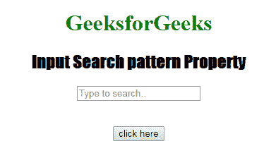
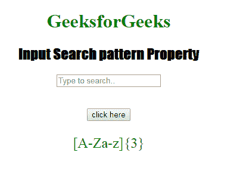

# HTML | DOM 输入搜索模式属性

> 原文:[https://www . geesforgeks . org/html-DOM-input-search-pattern-property/](https://www.geeksforgeeks.org/html-dom-input-search-pattern-property/)

HTML DOM 中的 **DOM 输入搜索模式属性**用于**设置**或**返回** *搜索字段的模式属性*。它用于指定检查输入元素值的正则表达式。使用全局标题属性来描述帮助用户的模式。

**语法:**

*   它返回输入搜索模式属性。

    ```html
    searchObject.pattern
    ```

*   它用于设置输入搜索模式属性。

    ```html
    searchObject.pattern = regexp
    ```

**属性值:**它包含单值正则表达式，用于指定检查搜索字段值所依据的正则表达式。

**返回值:**它返回一个字符串值，该值代表检查搜索字段值所依据的正则表达式。

**示例:**此示例说明了 Input 搜索模式属性的使用。

```html
<!DOCTYPE html>
<html>

<head>
    <title>
        Input Search pattern Property
  </title>
    <style>
        h1 {
            color: green;
        }

        h2 {
            font-family: Impact;
        }

        body {
            text-align: center;
        }
    </style>
</head>

<body>

    <h1>GeeksforGeeks</h1>
    <h2>
      Input Search pattern Property
  </h2>
    <form id="myGeeks">
        <input type="Search" 
               id="test" 
               placeholder="Type to search.."
               pattern="[A-Za-z]{3}">
    </form>
    <br>
    <br>
    <button ondblclick="Access()">
      click here
    </button>

    <p id="check" 
       style="font-size:24px;
              color:green;">
  </p>

    <script>
        function Access() {

            // type="search" 
            var s = document.getElementById(
                "test").pattern;

            document.getElementById(
                "check").innerHTML = s;
        }
    </script>

</body>

</html>
```

**输出:**
**点击按钮前:**


**点击按钮后:**


**支持的浏览器:**T2 DOM 输入搜索模式属性支持的浏览器如下:

*   谷歌 Chrome
*   Internet Explorer 10.0 +
*   火狐浏览器
*   歌剧
*   旅行队