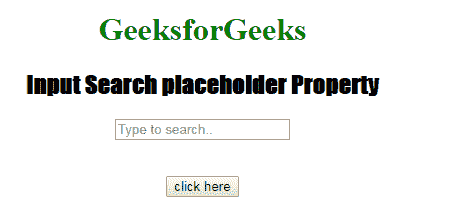
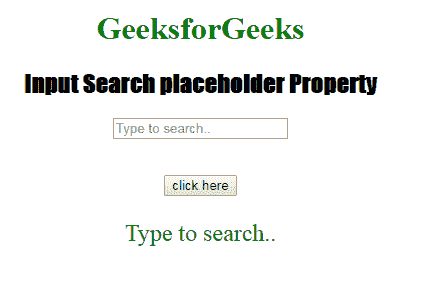
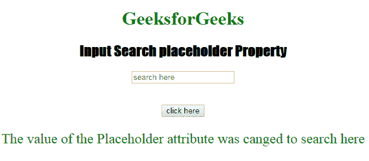

# HTML | DOM 输入搜索占位符属性

> 原文:[https://www . geesforgeks . org/html-DOM-input-search-placeholder-property/](https://www.geeksforgeeks.org/html-dom-input-search-placeholder-property/)

HTML DOM 中的 **DOM 输入搜索占位符属性**用于**设置**或**返回** *搜索字段的占位符属性值*。占位符属性指定描述输入字段预期值的简短提示。在用户输入值之前，短提示会显示在字段中。

**语法:**

*   它返回占位符属性。

```html
searchObject.placeholder
```

*   它用于设置占位符属性。

```html
searchObject.placeholder = text
```

**属性值:**它包含单值文本，用于定义描述搜索字段预期值的简短提示。

**返回值:**它返回一个字符串值，表示描述搜索字段预期值的简短提示。

**示例-1:** 本示例说明如何返回输入搜索占位符属性。

## 超文本标记语言

```html
<!DOCTYPE html>
<html>

<head>
    <title>
      Input Search placeholder Property
  </title>
    <style>
        h1 {
            color: green;
        }

        h2 {
            font-family: Impact;
        }

        body {
            text-align: center;
        }
    </style>
</head>

<body>

    <h1>GeeksforGeeks</h1>
    <h2>Input Search placeholder Property</h2>
    <form id="myGeeks">
        <input type="Search"
               id="test"
               placeholder="Type to search.."
               readOnly>
    </form>
    <br>
    <br>
    <button ondblclick="Access()">
      click here
    </button>

    <p id="check"
       style="font-size:24px;
              color:green;">
  </p>

    <script>
        function Access() {

            // type="search"
            var s = document.getElementById(
                "test").placeholder;

            document.getElementById(
                "check").innerHTML = s;
        }
    </script>

</body>

</html>
```

**输出:**

**点击按钮前:**



**点击按钮后:**



**示例-2:** 本示例说明如何**设置**输入搜索占位符属性。

## 超文本标记语言

```html
<!DOCTYPE html>
<html>

<head>
    <title>
      Input Search placeholder Property
  </title>
    <style>
        h1 {
            color: green;
        }

        h2 {
            font-family: Impact;
        }

        body {
            text-align: center;
        }
    </style>
</head>

<body>

    <h1>GeeksforGeeks</h1>
    <h2>Input Search placeholder Property</h2>
    <form id="myGeeks">
        <input type="Search"
               id="test"
               placeholder="Type to search.."
               readOnly>
    </form>
    <br>
    <br>
    <button ondblclick="Access()">
      click here
    </button>

    <p id="check"
       style="font-size:24px;
              color:green;">
  </p>

    <script>
        function Access() {

            // type="search"
            var s = document.getElementById(
                "test").placeholder = "search here";

            document.getElementById(
                "check").innerHTML =
            "The value of the Placeholder attribute was changed to "
            + s;
        }
    </script>

</body>

</html>
```

**输出:**

**点击按钮前:**


**点击按钮后:**



**支持的浏览器:****DOM 输入搜索占位符属性**支持的浏览器如下:

*   谷歌 Chrome
*   Internet Explorer 10.0 +
*   火狐浏览器
*   歌剧
*   旅行队