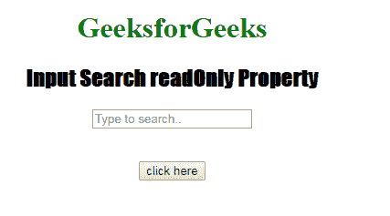

# HTML | DOM 输入搜索只读属性

> 原文:[https://www . geesforgeks . org/html-DOM-input-search-readonly-property/](https://www.geeksforgeeks.org/html-dom-input-search-readonly-property/)

**DOM 输入搜索只读属性**用于**设置**或**返回**搜索字段是否为只读。这意味着用户不能修改或更改特定元素中已经存在的内容(*但是，用户可以定位到它，突出显示它，并从中复制文本*)，而 JavaScript 可以用于更改只读值并使输入字段可编辑。

**语法**:

*   用于返回只读属性

    ```html
    searchObject.readOnly
    ```

*   它用于设置只读属性。

    ```html
    searchObject.readOnly = true|false
    ```

**属性值:**

*   **true:** 定义搜索字段为只读。
*   **false:** 为默认值。它定义搜索字段不是只读的。

**返回值:**返回一个布尔值，表示搜索字段是否为只读。

**示例-1:** 这个示例说明了如何返回属性。

```html
<!DOCTYPE html>
<html>

<head>
    <title>
      Input Search readOnly Property
  </title>
    <style>
        h1 {
            color: green;
        }

        h2 {
            font-family: Impact;
        }

        body {
            text-align: center;
        }
    </style>
</head>

<body>

    <h1>GeeksforGeeks</h1>
    <h2>Input Search readOnly Property</h2>
    <form id="myGeeks">
        <input type="Search"
               id="test"
               placeholder="Type to search.." 
               readOnly>
    </form>
    <br>
    <br>
    <button ondblclick="Access()">
      click here
    </button>

    <p id="check"
       style="font-size:24px;
              color:green;">
  </p>

    <script>
        function Access() {

            // type="search" 
            var s = document.getElementById(
                "test").readOnly;

            document.getElementById(
                "check").innerHTML = s;
        }
    </script>

</body>

</html>
```

**输出:**
**点击按钮前:**


**点击按钮后:**


**示例-2:** 本示例说明如何**设置**属性。

```html
<!DOCTYPE html>
<html>

<head>
    <title>
      Input Search readOnly Property
  </title>
    <style>
        h1 {
            color: green;
        }

        h2 {
            font-family: Impact;
        }

        body {
            text-align: center;
        }
    </style>
</head>

<body>

    <h1>GeeksforGeeks</h1>
    <h2>Input Search readOnly Property</h2>
    <form id="myGeeks">
        <input type="Search" 
               id="test" 
               placeholder="Type to search.." 
               readOnly>
    </form>
    <br>
    <br>
    <button ondblclick="Access()">
      click here
    </button>

    <p id="check" 
       style="font-size:24px;
              color:green;">
  </p>

    <script>
        function Access() {

            // type="search" 
            var s = document.getElementById(
                "test").readOnly = false;

            document.getElementById(
                "check").innerHTML = s;
        }
    </script>

</body>

</html>
```

**输出:**
**点击按钮前:**


**点击按钮后:**


**支持的浏览器:**T2 DOM 输入搜索只读属性支持的浏览器如下:

*   谷歌 Chrome
*   Internet Explorer 10.0 +
*   火狐浏览器
*   歌剧
*   旅行队