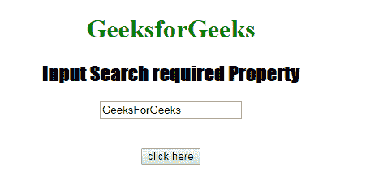
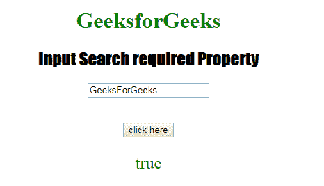
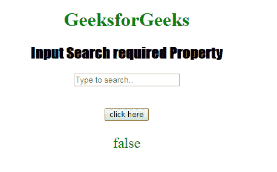

# HTML | DOM 输入搜索所需属性

> 原文:[https://www . geesforgeks . org/html-DOM-input-search-required-property/](https://www.geeksforgeeks.org/html-dom-input-search-required-property/)

HTML DOM 中的 **DOM 输入搜索必填属性**用于**设置**或**返回**提交表单时是否填写*输入搜索字段。此属性用于反映所需的 HTML 属性。*

**语法:**

*   它返回需要输入搜索的属性。

    ```html
    searchObject.required
    ```

*   它用于设置需要输入搜索的属性。

    ```html
    searchObject.required = true|false
    ```

**属性值:**

*   **true:** 指定提交表单前必须填写搜索字段。
*   **false:** 为默认值。它指定在提交表单之前不得填写搜索字段。

**返回值:**返回一个布尔值，表示提交表单前必须填写或不填写搜索字段。

**示例-1:** 本示例说明如何返回 Input 搜索必需属性。

```html
<!DOCTYPE html>
<html>

<head>
    <title>
      Input Search required Property
  </title>
    <style>
        h1 {
            color: green;
        }

        h2 {
            font-family: Impact;
        }

        body {
            text-align: center;
        }
    </style>
</head>

<body>

    <h1>GeeksforGeeks</h1>
    <h2>Input Search required Property</h2>
    <form id="myGeeks">
        <input type="Search" 
               id="test" 
               placeholder="Type to search.." 
               value="GeeksForGeeks" 
               required>
    </form>
    <br>
    <br>
    <button ondblclick="Access()">
      click here
    </button>

    <p id="check" 
       style="font-size:24px;
              color:green;">
  </p>

    <script>
        function Access() {

            // type="search" 
            var s = document.getElementById(
                "test").required;

            document.getElementById(
                "check").innerHTML = s;
        }
    </script>

</body>

</html>
```

**输出:**

**点击按钮前:**


**点击按钮后:**


**示例-2:** 本示例说明如何**设置**输入搜索所需的属性。

```html
<!DOCTYPE html>
<html>

<head>
    <title>
      Input Search required Property
  </title>
    <style>
        h1 {
            color: green;
        }

        h2 {
            font-family: Impact;
        }

        body {
            text-align: center;
        }
    </style>
</head>

<body>

    <h1>GeeksforGeeks</h1>
    <h2>Input Search required Property</h2>
    <form id="myGeeks">
        <input type="Search" 
               id="test" 
               placeholder="Type to search.." 
               required>
    </form>
    <br>
    <br>
    <button ondblclick="Access()">
      click here
    </button>

    <p id="check" 
       style="font-size:24px;
              color:green;">
  </p>

    <script>
        function Access() {

            // type="search" 
            var s = document.getElementById(
                "test").required = false;

            document.getElementById(
                "check").innerHTML = s;
        }
    </script>

</body>

</html>
```

**输出:**
**点击按钮前:**


**点击按钮后:**


**支持的浏览器:****DOM 输入搜索所需属性**支持的浏览器如下:

*   谷歌 Chrome
*   Internet Explorer 10.0 +
*   火狐浏览器
*   歌剧
*   旅行队